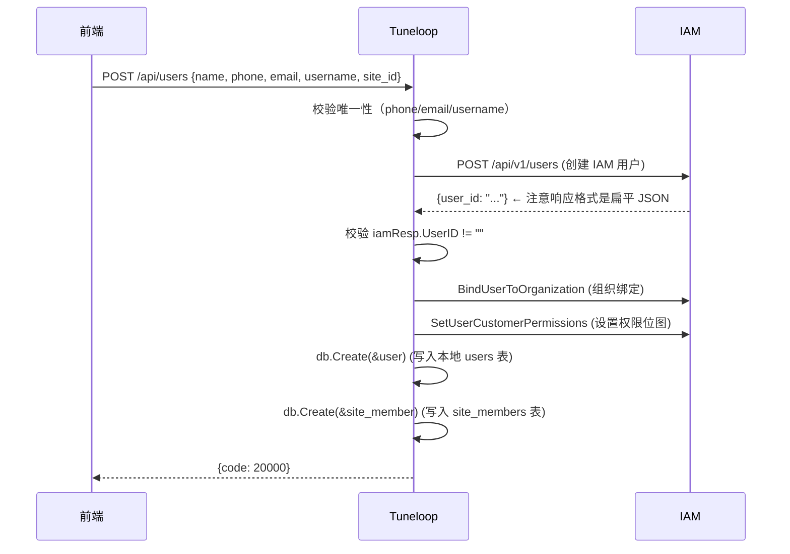
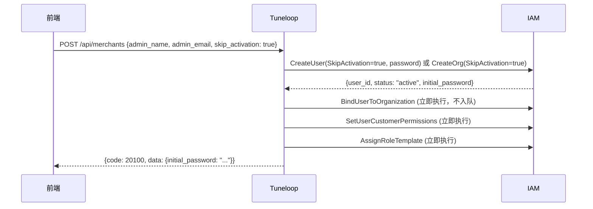

# 账户生命周期与数据完整性

> 一个可登录、有权限、有关联网点的用户，必须在三个系统中同时存在且数据一致。

## 系统分布

| 系统 | 数据库 | 表 | 存储内容 |
|------|--------|-----|----------|
| **IAM** | `beaconiam_debug` | `users` | IAM 侧用户身份 |
| **IAM** | `beaconiam_debug` | `user_org_relations` | 组织绑定 + 权限位图 |
| **Tuneloop** | `tuneloop_debug` | `users` | 本地用户记录 |
| **Tuneloop** | `tuneloop_debug` | `site_members` | 网点关联 |

## 创建流程

### 普通创建（需邮箱确认）


### skip_activation=true（直接激活）

管理员创建时可以使用 `skip_activation=true` 跳过邮箱确认流程，用户直接激活：



**关键差异**：
- IAM 用户状态直接为 `active`，无需邮箱确认
- BindUser、SetUserCustomerPermissions、AssignRoleTemplate 全部同步执行，不入队
- 响应中返回 `initial_password`，前端需展示给管理员

## 用户数据完整性清单

一个完整的用户账户，必须满足以下全部条件：

### 1. IAM 侧
- [ ] `beaconiam_debug.users` 有记录 → `id` 即为 IAM 用户 ID
- [ ] `beaconiam_debug.user_org_relations` 有记录:
  - `user_id` = IAM 用户 ID
  - `org_id` = 所属组织的 ID（朝阳店 = `65ad8d7f-...`）
  - `role` = 业务角色（`site_member` / `site_admin` 等）
  - `cus_perm` ≠ 0（非零权限位图）
  - `sys_perm` 按角色需求设定

### 2. Tuneloop 侧
- [ ] `tuneloop_debug.users` 有记录:
  - `iam_sub` = IAM 用户 ID（与 IAM 侧的 `id` 一致）
  - `tenant_id` = 租户 ID
  - `org_id` = 组织 ID
- [ ] `tuneloop_debug.site_members` 有记录:
  - `user_id` = 本地用户 ID
  - `site_id` = 关联网点 ID
  - `role` = 网点角色（`site_member`）

## 常见缺失模式与症状

| 缺失环节 | 症状 |
|----------|------|
| `iam_sub` 为空 | IAM 用户已创建但本地未关联 → 可登录 IAM 但 JWT 无 tid/oid → 40104 被踢回登录页 |
| 无 `user_org_relations` | IAM 用户有但无组织绑定 → JWT 无 tid/oid → 同上 |
| `cus_perm = 0` | 组织绑定有但权限位图未设 → 前端菜单全部隐藏，显示"权限不足" |
| 无 `site_members` | 本地记录有但无网点关联 → 人员管理列表"关联网点"为空 |

## 关键陷阱

### IAM CreateUser 响应格式
IAM API 返回**扁平**格式 `{"user_id": "xxx"}`，但 `iam_client.go` 先尝试解析嵌套格式 `{"data": {"user_id": "xxx"}}`。
- 第一层 `json.Unmarshal` 对扁平响应**静默成功**（缺失的 `data` 键→零值，不报错）
- `UserID` 为空 → 后续绑定全部跳过
- **修复**：`err != nil || result.Data.UserID == ""` 条件触发 fallback

### 角色权限位图
`cus_perm` 是位图整数，由 `ComputeCusPermBitmapExt` 根据 `PermissionRegistry` 的 bit 映射计算:
- site_member (值=8679): instrument:create/read/update/maintain + order:create/read/update + audit_log:read
- site_admin (值=待确认): 包含以上 + instrument:delete + order:cancel + appeal:read/handle
- `sys_perm` 为 0 时中间件 pass-through，不阻塞请求

## 手动修复参考

```bash
# 1. 设 iam_sub
docker exec -it jobmaster-postgres psql -U tuneloop_user -d tuneloop_debug \
  -c "UPDATE users SET iam_sub = '<IAM_USER_ID>' WHERE id = '<LOCAL_USER_ID>';"

# 2. 建立 IAM 组织绑定
docker exec -it jobmaster-postgres psql -U iam_user -d beaconiam_debug \
  -c "INSERT INTO user_org_relations (id, user_id, org_id, role, is_active, created_at, updated_at)
       VALUES (gen_random_uuid(), '<IAM_USER_ID>', '<ORG_ID>', 'site_member', true, now(), now());"

# 3. 设 IAM 权限位图
docker exec -it jobmaster-postgres psql -U iam_user -d beaconiam_debug \
  -c "UPDATE user_org_relations SET cus_perm = 8679
       WHERE user_id = '<IAM_USER_ID>' AND org_id = '<ORG_ID>';"

# 4. 建本地网点关联
docker exec -it jobmaster-postgres psql -U tuneloop_user -d tuneloop_debug \
  -c "INSERT INTO site_members (tenant_id, site_id, user_id, role)
       VALUES ('<TENANT_ID>', '<SITE_ID>', '<LOCAL_USER_ID>', 'site_member');"
```

---

## 六、媒体数据生命周期

### 6.1 基本规则

`instrument_media` 表记录的媒体数据遵循以下生命周期规则：

| 事件 | 行为 | 说明 |
|------|------|------|
| 用户移除（网点/商户） | 记录保留 | 媒体归属乐器而非用户，ON DELETE SET NULL |
| 乐器删除 | 级联删除 | `instrument_id` 外键 `ON DELETE CASCADE` |
| 商户/租户删除 | 手动清理 | MediaCleanupService 输出待清理列表，管理员确认后执行 |

### 6.2 定时清理

- **服务**: `MediaCleanupService`（`backend/services/media_cleanup.go`）
- **间隔**: 每 24 小时执行一次
- **保留期**: `MEDIA_RETENTION_YEARS`（默认 5 年），通过环境变量或 `system_settings` 表配置
- **行为**: 仅输出待清理批次列表和 SQL 提示，不自动删除（需人工确认后手动执行）
- **红线**: AGENTS.md 禁止 AI 自行修改数据库，清理必须由用户确认

---

> 来源: #701 事故 — IAM 响应格式变迁导致 `iam_sub` 为空，连锁引发绑定、权限、网点三缺。
