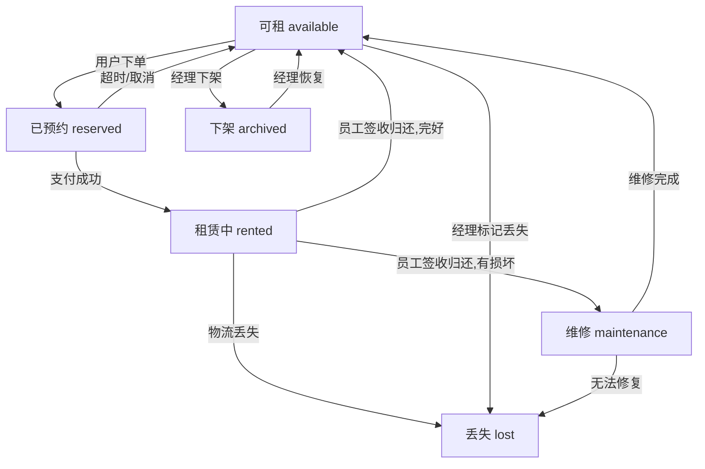
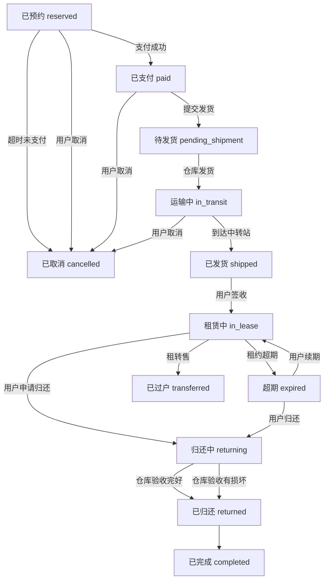
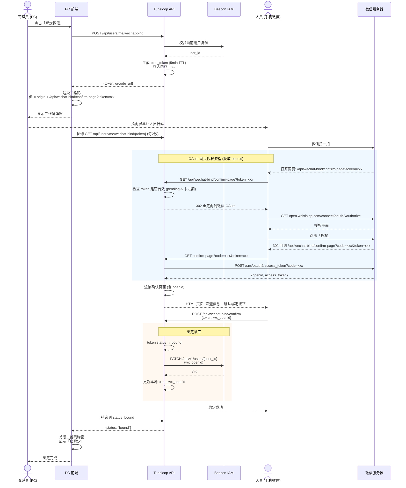

# 用例合集

## 0. 冷启动 (Bootstrapping)

**目标**: 建立系统第一个超级管理员，并锁定初始化入口。

### 0.1 系统初始化流程

1. **访问首页**: 用户访问 `/`
2. **系统检测**: 后端检测 `User` 表是否为空
3. **路由锁定**:
   - 若 `User` 表为空 → 前端自动跳转至 `/setup`
   - 若 `User` 表不为空且访问 `/setup` → 返回 403 或重定向至登录页
4. **创建系统管理员**:
   - 页面显示表单：邮箱、密码
   - 后端动作：
     a. 调用 IAM 创建该用户（角色：Project Admin）
     b. 在 Tuneloop 本地 `users` 表记录 UID
     c. 标记 `is_system_admin = true`
5. **登录循环**: 创建成功后跳转回 `/`，触发 OIDC 流程跳转 IAM 完成首次认证

---

## 0.1 商户管理 (Merchant Management)

**术语对齐**: 商户 (Merchant) → IAM 组织 (Organization)

### 0.1.1 商户列表

**权限**: 仅 JWT 中带有 `project_admin` 声明的用户可见

- 展示字段：商户名称、创建时间、商户唯一代码 (Code/Slug)
- **删除逻辑**: 若该商户下仍有活跃网点或未结清乐器订单，禁止删除

### 0.1.2 商户创建

**表单字段**:
- 商户名称
- 商户代码（用于 URL 或数据隔离标识）
- 联系人信息（姓名、邮箱、电话）
- **指定管理员**: 支持两种场景：
  1. **已有用户** — 搜索 Tab 输入用户名/邮箱/手机，下拉选中，提交 `admin_uid`
  2. **新建用户** — 创建 Tab 填写用户名/姓名/邮箱/手机，提交时 `admin_uid=null`，后端先创建 IAM 用户再创建组织

**后端动作**:
1. 判断 `admin_uid`：
   - 有值 → 场景1，直接使用该用户 ID 创建组织
   - 为 null → 场景2，先调用 IAM `POST /api/v1/users` 创建用户
2. IAM 用户创建：
   - 成功 → 获取 `user_id`，填入 `admin_uid`，继续创建组织
   - 用户名冲突 → 返回 `409` + 已存在用户信息（id/name/email/phone），前端自动切换为场景1
3. 调用 IAM `POST /api/v1/namespaces/:id/organizations` 创建顶级组织
4. IAM 确认后 302 重定向至 `callback_url`，Tuneloop 执行本地同步操作
5. Tuneloop 本地 `merchants` 表记录商户信息及管理员 UID

---

## 0.2 指定用户流程 (User Selection & Provisioning)

**设计思想**: 表单内联、先查后联、无则创建、确认会话。

> **交互模式变更**: 用户搜索与创建功能**直接内嵌在表单中**，不再使用弹窗对话框。
> 搜索框和创建用户按钮作为表单字段的一部分呈现，已选用户以列表形式显示在表单内。

> **商户创建场景特殊说明**: 管理员指定使用双 Tab 结构（搜索/创建），与下文流程一致。区别在于：
> 1. 创建 Tab 提交时 `admin_uid=null`，管理员信息随商户表单一并提交（无需单独「创建并添加」按钮）
> 2. IAM 用户名冲突时后端返回 `409` + 已存在用户详情，前端**自动切换**为搜索 Tab 并预填选中
> 3. 站点/网点成员管理等其他场景不受影响，使用标准流程（见 §0.2.1 - §0.2.4）

### 0.2.1 用户输入与搜索

**界面元素**（内嵌于表单，Tab 切换）:
- **搜索 Tab**：用户搜索输入框（AutoComplete）+ 搜索结果下拉列表
- **创建 Tab**：点击即显示创建表单
- 已选用户列表（显示在 Tab 区域下方）

**交互流程**:
1. 默认为搜索 Tab
2. 在搜索框中输入用户名、邮箱或手机号
3. 系统自动以输入为关键字搜索（debounce 300ms）
4. 下拉框显示搜索结果（最多10项），每项显示：
   - 用户名
   - 匹配的字段（如匹配到邮箱则显示邮箱）
   - 是否已与当前商户关联（associated 标志）
5. 点击结果项添加到已选用户列表
6. 切换到创建 Tab 显示创建表单（隐藏搜索区域）
7. 已选用户始终显示在 Tab 区域下方，可继续搜索添加（多选场景）

**搜索逻辑**:
- 后端分别模糊匹配 name、email、phone 字段
- 返回匹配的用户列表，每项包含：id、name、email、phone、matched_field、associated
- associated=false 表示该用户尚未与当前商户关联

### 0.2.2 已选用户列表

**列表显示**:
- 用户名
- 邮箱
- 手机号
- 删除按钮（每行）
- associated=false 的用户显示醒目标识

**操作**:
- 点击删除按钮从列表中移除用户
- 单选场景（如指定网点管理员）：只显示一条记录，选中后替换已有选择
- 多选场景（如网点增加成员）：显示多条记录，支持批量选择

### 0.2.3 创建新用户

**触发方式**:
- 点击「创建」Tab，直接显示创建表单（无需额外按钮）

**创建表单**（内联展开）:
- 用户名（必填）
- 邮箱（选填，配置后可支持密码重置）
- 手机号（选填）
- 密码设置：支持手动设密或自动生成（12位随机密码）
- 首次登录强制修改密码开关

**四种创建场景**:

| 场景 | admin 操作 | password | 结果 |
|------|-----------|----------|------|
| A | 手动设密 | 提供 | 用户直接激活，无邮件 |
| B | 自动生成（无邮箱） | 空 | 用户激活，前端展示初始密码 |
| C | 自动生成（有邮箱） | 空 | IAM 生成密码 + 发邮件通知 |
| D | 兼容旧流程 | 空 | IAM 发确认邮件 |

**密码规则**（前后端双重校验）:
- 长度 ≥ 8
- 至少 1 个大写字母
- 至少 1 个小写字母
- 至少 1 个数字

**自动生成算法**: 先保证 1 位数字 + 1 位大写 + 1 位小写，再填充 9 位随机字符（大写+小写+数字），最终 shuffle。

**创建成功后流程**:
- 自动生成密码 → 弹出 Modal 展示初始密码（仅展示一次，关闭后无法查看）
- 手动设置密码 → 直接创建成功
- 邮箱为空时，重置密码按钮灰显

### 0.2.4 确认会话 (Confirmation Session)

**架构决策**: 确认流程委托 IAM 管理，Tuneloop 仅接收回调。

**业务规则**:
- 商户创建时，如指定管理员为新用户，IAM 自动发送确认邮件
- 网点添加成员时，**无需确认**（下级组织仅邮件通知）
- 确认提示（仅在商户创建场景）：
  「管理员需在确认邮件中点击确认链接，才会完成商户创建流程」

**IAM 确认流程**:
1. Tuneloop 调用 IAM API 时传入 `callback_url`
2. IAM 创建确认会话（Redis，TTL=24h），发送确认邮件
3. 用户点击邮件中的确认链接 → IAM `GET /confirm?session={id}&action={accept|reject}`
4. IAM 处理确认后 302 重定向至 `callback_url?result=accept|reject|failed`
5. Tuneloop 回调端点接收重定向，执行本地同步操作

**确认类型 (confirm_type)**:
- `create_user`: 用户 status → active
- `create_org`: 用户 status → active + 完成组织绑定；reject → 组织进入孤儿状态（24h 清理）
- `update_user`: 更新用户邮箱
- `bind`: 完成用户与组织绑定

**本地确认会话（状态跟踪）**:
- Tuneloop 本地 `confirmation_sessions` 表仅用于状态跟踪
- 新增 `iam_session_id` 字段关联 IAM 会话
- 新增 `callback_url` 字段记录回调地址
- 回调时同步更新本地会话状态

**失败处理**:
- 超过24小时未确认 → IAM 自动将状态更新为 expired
- 回调 result=failed → 本地记录失败日志

### 0.2.6 个人密码重置

**触发方式**: 用户在个人中心点击「通过邮件重置密码」

**角色**: 所有已登录用户

**前置条件**: 用户已绑定邮箱（`users.email` 不为空）

**操作流程**:
1. 用户点击「通过邮件重置密码」按钮
2. 弹窗确认：「系统将向您的邮箱 xxx 发送密码重置邮件，邮件中的链接 24 小时内有效」
3. 确认后调用 `POST /api/user/reset-password`
4. 后端检查频率限制：每用户每 30 分钟最多 3 次
5. 后端查本地 `users` 表获取邮箱，验证不为空
6. 后端通过服务认证（client_credentials）调用 beaconiam `POST /api/v1/users/reset-password?user_ids=xxx`
7. beaconiam 创建 ConfirmationSession（ConfirmSetupPassword），发送中文密码重置邮件
8. 用户点击邮件中链接，在 beaconiam 页面设置新密码

**密码重置后 JWT 状态**:
- 现有 tuneloop JWT Token 仍然有效（直到过期）
- 这是 JWT 无状态特性决定的，非 bug
- 如需强制所有会话失效，需 beaconiam 侧支持 Token Revocation List（TRL）
- 用户可主动登出后重新登录

**频率限制**:
- 每用户每 30 分钟最多 3 次
- 超出返回 `42900`：「操作过于频繁，请 30 分钟后再试」

**错误处理**:
- 邮箱为空：「您的账户未绑定邮箱，请联系管理员」
- 发送失败：「邮件发送失败，请稍后重试」

**API 代理端点**:
- `POST /api/user/reset-password` — tuneloop 后端代理转发到 beaconiam
- 不涉及密码输入/存储，仅做代理转发

### 0.2.7 自服务修改密码

**触发方式**: 用户在个人中心点击「修改密码」或首次登录强制改密

**角色**: 所有已登录用户

**操作流程**:
1. 用户在新密码表单填写新密码 + 确认密码
2. 前端校验：8位 + 大写 + 小写 + 数字
3. 调用 `POST /api/user/change-password`（`{ new_password }`）
4. 后端双重校验密码规则
5. 后端通过服务认证调用 IAM `PUT /api/v1/users/:id`（更新 password 字段）
6. IAM 成功后，后端清除本地 `users.force_password_change` 标志
7. 返回成功

**频率限制**: 每用户每 5 分钟最多 3 次

**首次登录强制改密**:
- 创建用户时设置 `force_password_change=true`
- `GET /api/users/me` 返回 `force_password_change` 字段
- 前端 `GET /api/users/me` 检查该标志，true 时重定向到 `/user/change-password?first_login=1`
- 后端 `RequirePasswordNotForceChange` 中间件拦截所有 API（除 `/user/change-password`），返回 40302

### 0.2.5 后端实现要点

**IAM Client 代理层**:
- `GetClientToken()` → IAM Token Endpoint (client_credentials grant) — 仅用于 M2M 场景（回调、定时任务等）
- `ExtractUserToken(c *gin.Context)` → 从请求 cookie 或 Authorization header 提取用户 JWT — 用于用户发起的操作
- 用户发起的操作（创建组织/绑定用户等）使用用户 JWT，确保 IAM 权限检查（Owner/Admin 角色）通过
- M2M 操作（回调处理等）使用 client_credentials
- `CreateOrganization(name, parentID, adminInfo, callbackURL)` → POST /namespaces/:id/organizations
- `CreateOrganizationWithToken(token, ...)` → 同上，使用用户 JWT 认证
- `CreateUser(username, name, email, phone, callbackURL)` → POST /api/v1/users
- `CreateUserWithToken(token, ...)` → 同上，使用用户 JWT 认证
- `UpdateUser(userID, name, email, phone, password, callbackURL)` → PUT /api/v1/users/:id
- `BindUserToOrganization(userID, orgID, role)` → PUT /users/:uid/organizations/:oid/bind
- `BindUserToOrganizationWithToken(token, userID, orgID, role, operatorID)` → 同上，使用用户 JWT 认证
- `UnbindUserFromOrganization(userID, orgID)` → PUT (action=unbind)

**新增 API**:
- `GET /api/iam/users/search?q=xxx&limit=10&merchant_id=xxx` —— 模糊搜索用户，返回关联状态
- `POST /api/iam/users` —— 创建用户（传入 callback_url，移除 skipEmail）
- `PUT /api/iam/users/:id` —— 修改用户（邮箱变更触发 IAM 确认）
- `GET /api/iam/confirmation-callback` —— 接收 IAM 确认回调（302 重定向）

**修改 API**:
- `POST /api/merchants` —— 调用 IAM Create Organization（传入 admin 信息 + callback_url）
- `POST /api/sites` —— 新增调用 IAM Create Organization (parent_id=商户org_id) + IAM 三步绑定管理员
- `POST /api/sites/:id/members` —— 调用 IAM Bind API + SetUserCustomerPermissions + AssignRoleTemplate（三步绑定）
- `PUT /api/sites/:id/members/:uid` —— 调用 IAM UpdateUserRoleInOrg/Bind + AssignRoleTemplate 同步角色变更

**数据模型**:
- `sites.org_id` 语义变更：网点自身的 IAM 组织 ID（非商户的组织 ID）
- `confirmation_sessions` 新增 `iam_session_id`、`callback_url` 字段

### 通用 IAM 绑定三步骤

所有人-组织-角色绑定操作统一遵循以下顺序：

1. **BindUser** — PUT /organizations/:oid/users/:uid/bind (action=bind)，建立 user-org 关系，设置 org role（OWNER|ADMIN|STAFF|WORKER）
2. **SetUserCustomerPermissions** — PUT /organizations/:oid/users/:uid/customer-permissions (raw_bits=true)，按角色模板写个人 cus_perm 位图
3. **AssignRoleTemplateToUserWithToken** — POST /users/:uid/roles (role_ids=[template_id])，分配功能角色模板决定 JWT roles/sys_perm

角色名映射：site_admin→ADMIN, site_member→STAFF, worker→WORKER（兼容旧格式 Manager/Staff）

本地 DB 缓存（site_members/users）在所有 IAM 调用成功后同步写入。

---


---

## 0.3 乐器与订单状态机 (Instrument & Order State Machine)

### Instrument 状态机

乐器自身状态与订单流转状态分离。乐器状态仅反映物理状态：



| 状态代码 | 中文名 | 说明 |
|----------|--------|------|
| `available` | 可租 | 乐器在库，可供租赁 |
| `reserved` | 已预约 | 订单已创建但未支付，乐器暂时锁定（超时30分钟自动释放） |
| `rented` | 租赁中 | 乐器已租出（含发货/运输/归还途中） |
| `maintenance` | 维修 | 乐器损坏，等待或正在维修 |
| `archived` | 下架 | 乐器已下架，不对外租赁 |
| `lost` | 丢失 | 乐器已丢失（物流丢失或实物灭失） |

### Order 状态机

订单状态覆盖从下单到完成的完整流转：



| 状态代码 | 中文名 | 说明 |
|----------|--------|------|
| `reserved` | 已预约 | 订单已创建，等待支付（30分钟超时自动取消） |
| `paid` | 已支付 | 支付已完成，等待发货 |
| `pending_shipment` | 待发货 | 支付完成，准备物流 |
| `in_transit` | 运输中 | 乐器已发出，到达转运站前（用户可取消） |
| `shipped` | 已发货 | 已到达目的地（不可取消） |
| `in_lease` | 租赁中 | 用户已签收，租期内 |
| `returning` | 归还中 | 用户已提交归还，返程物流中 |
| `returned` | 已归还 | 仓库验收完成 |
| `completed` | 已完成 | 租赁流程全部结束 |
| `cancelled` | 已取消 | 订单已取消 |
| `expired` | 超期 | 租约已过期，每日凌晨 1:00 自动扣前一天逾期费（从预付点扣，余额不足则挂账），可续期或归还 |
| `transferred` | 已过户 | 租转售完成，乐器所有权转移 |

### 角色可见性

- **用户（顾客）**:
  - 查看乐器列表：除了下架外可见所有乐器，状态只显示"可租"/"不可租"（非 available 即为不可租）
  - 在租赁列表中可看到自己租赁乐器的真实状态
- **员工**:
  - 查看乐器列表：除下架外可见所有乐器及真实状态
- **网点经理**:
  - 查看乐器列表：可见所有乐器（含下架）
  - available/maintenance 状态可切换为 archived，archived 可切换回 available/maintenance
  - 提供开关，可切换查看下级网点乐器（含所属网点列）
- **商户管理员**:
  - 同网点经理，可查看下级网点所有乐器

### 订单可见性

- **用户（顾客）**:
  - 仅可查看自己创建的订单（按 `user_id` 过滤）
- **员工 / 网点管理员**:
  - 可查看所属网点的全部订单（按乐器的 `site_id` 过滤）
  - 不可查看其他网点的订单

---

## 1. 乐器列表
### 1.1 乐器录入

**角色**：租户管理员、网点管理员、网点成员

#### 操作流程

1. **进入乐器录入页面**
   - 从导航栏进入乐器列表 `/instruments`
   - 点击"新建乐器"按钮，跳转至 `/instruments/new`

2. **填写基本信息**
   - **识别码 (sn)**：必填，输入后自动调用后端 API 校验唯一性
   - **乐器分类**：树形下拉框，支持懒加载，点击结点选中，提供链接跳转分类管理
   - **乐器分级**：下拉选择（入门、专业、大师）
   - **归属网点**：
     - 租户管理员：可选任意网点
     - 网点管理员/成员：默认锁定当前所属网点，不可修改

3. **填写附加信息**
   - **描述**：文本输入
    - **动态属性**：根据属性管理中定义的属性，显示对应输入控件
      - 下拉框选择现有值 + 直接输入均可
      - 输入时实时搜索过滤，提供包含输入值的前 3 个常用项
      - 级联选择：选择分类后，category-scoped 属性（如品牌）按分类过滤；选择父属性值后，property-scoped 属性（如型号）按父值过滤
      - 输入已知别名时（如"yamaha"→"雅马哈"），系统自动映射为标准值，无需审批
      - 输入不存在的新值时，该值自动进入"待核定"状态
      - 提供链接跳转属性管理

4. **上传媒体文件**
   - 图片：最多 6 张，支持拖拽上传
   - 视频：最多 1 段
   - 前端先上传媒体文件到服务器，返回文件 UUID
   - 提交表单时将 UUID 附带上

5. **提交或取消**
   - 点击"提交"：创建乐器成功，返回列表页
   - 点击"取消"：直接返回列表页，不保存

#### 权限说明

| 角色 | 创建乐器 | 默认网点锁定 |
|------|---------|-------------|
| 租户管理员 | ✅ | ❌ 可选 |
| 网点管理员 | ✅ | ✅ 锁定当前网点 |
| 网点成员 | ✅ | ✅ 锁定当前网点 |

### 1.2 乐器批量录入

**场景**：租户管理员或网点管理员需要一次性录入大量乐器（如盘点入库）

**角色**：租户管理员、网点管理员

**前置条件**：已准备好 CSV 模板和对应的乐器图片/视频文件

#### 操作流程

1. **下载模板**
   - 进入乐器列表页面
   - 点击"批量导入"按钮
   - 下载 CSV 模板（包含字段：识别码、分类、级别、描述及动态属性列）
   - 参考模板说明填写数据

2. **上传 CSV 校验**
   - 选择已填好的 CSV 文件上传
   - 系统立即解析并在 Grid 表格中展示数据
   - 自动高亮错误行：
     - 识别码与库中重复（红色背景）
     - 识别码在文件内重复（红色背景）
     - 必填项缺失（红色背景）

3. **在线纠错**
   - 双击错误单元格直接修改
   - 无需重新上传文件
   - 修改后自动重新校验

4. **上传媒体文件包（可选）**
   - 上传 ZIP 文件（包含图片/视频，命名格式：识别码_序号.jpg）
   - 系统自动匹配到对应乐器
   - 未匹配的文件显示在"未匹配区"，可修改文件名后重新匹配

5. **确认创建**
   - 点击"确认导入"
   - 系统事务性创建乐器
   - 完成后显示结果：成功 X 条，失败 Y 条及详情

#### 异常处理

- 文件格式错误：提示正确的 CSV 格式
- 识别码重复：阻止导入，提示冲突
- 部分成功：显示成功/失败明细，支持单独重试失败项

### 1.3 游客浏览乐器（新增）

**角色**：游客（未登录用户）

**场景**：用户打开微信前端链接，无需登录即可浏览乐器列表和详情。

#### 操作流程

1. **访问首页（无参数）**
   - 游客打开链接 `/` 或扫描二维码进入
   - 前端调用 `GET /api/public/instruments`（不含 `tenant` 参数）
   - 后端返回**所有租户**的乐器列表
   - 页面展示乐器图片、名称、租金、网点等信息

2. **带租户参数的访问**
   - 游客打开链接 `/?tenant=<tenant_id>`
   - 前端检测 URL 中的 `tenant` 参数并附加到 API 请求
   - 后端仅返回该商户的乐器列表
   - 适用于不同商户的推广链接场景

3. **浏览乐器详情**
   - 点击乐器卡片进入详情页 `/instrument/:id`
   - 调用 `GET /api/public/instruments/:id`
   - 显示完整信息（租金政策、级别选择、网点位置、服务权益对比）

4. **下单入口**
   - 底部"立即租赁"按钮：未登录则跳转登录，已登录则进入结算流程

### 1.4 购物车管理

**角色**：游客 / 已登录用户

**场景**：用户希望一次租赁多部乐器，先收集到购物车再统一下单。

#### 操作流程

1. **悬浮购物车图标**
   - 屏幕右下角悬浮显示购物车图标
   - 图标右上角显示数字角标（购物车中乐器件数）
   - 点击跳转到 `/cart` 购物车页面

2. **加入购物车**
   - 在乐器详情页，若乐器状态为 `available`（可租），底部显示"加入购物车"按钮
   - 若该乐器已在购物车中，按钮显示"已加入"并 disabled
   - 点击"加入购物车"，数据存储到 localStorage `cart` key：
     ```json
     { "items": [{ "id", "instrument_id", "sn", "name", "cover_image", "category_name",
       "daily_rent", "deposit", "shipping_fee", "rent_qty": 30,
       "site_id", "site_name", "site_address", "site_phone",
       "tenant_id", "tenant_name", "level_name" }] }
     ```
   - 弹出"加入成功"Toast，提供两个选项：
     - **继续浏览**：关闭弹窗，留在详情页
     - **去结算**：导航至 `/cart` 购物车页面
   - 悬浮购物车图标数字 +1

3. **查看购物车**
   - 用户访问 `/cart` 页面，从 localStorage 读取购物车数据
   - **三级分组展示**：商户 → 网点 → 乐器
   - 每项显示：复选框、缩略图、SN/名称、级别标签、分类标签、租期调节器（—/N天/+）
   - 每项右侧显示费用明细：租金（日租金×天数）、押金、物流费、小计
   - 每项有删除按钮，点击确认后从购物车移除
   - 加载时检查乐器状态，已下架/被租者置灰显示"已失效"，提供"一键清理"

4. **复选框选择**
   - 每项左侧有复选框，默认全选
   - 仅选中项计入**网点小计**和**合计总额**
   - 取消选中后网点小计和合计实时更新
   - 合计为 ¥0 时"去结算"按钮灰色禁用

5. **网点汇总**
   - 每网点显示：发货仓地址、电话
   - 网点小计 = Σ选中项(租金+押金) + 物流费（仅当该网点至少有一项选中时计入）

6. **收货地址**
   - 批量下单在结算页（`/checkout`）收集收货地址
   - 每用户可维护多个地址（CRUD 接口 `user/addresses`）
   - 下单时可选既有地址或填写新地址
   - 填写新地址时，默认勾选「设置为我的收货地址」加入地址簿
   - 无论是否勾选保存，地址均作为订单的 `delivery_address` 写盘
   - 各字段：收货人、电话、省、市、区、详细地址、邮编

7. **费用明细**
   - 每件：日租金 × 租期（默认30天）+ 押金 + 物流费
   - 每网点：+ 物流费（取该组最大的 shipping_fee，计入仅当至少一项选中）
   - 底部合计：Σ选中项(租金+押金) + Σ选中网点物流费

6. **空购物车**
   - 购物车为空时显示空状态提示
   - 提供"去逛逛"按钮，点击返回首页

### 1.5 批量下单

**角色**：已登录用户

**场景**：从购物车提交多件乐器的租赁订单。

#### 操作流程

1. **下单校验**
   - 用户点击购物车底部"去结算"按钮
   - 系统检查登录状态：
     - 未登录 → 跳转登录页，登录后返回购物车
     - 已登录 → 导航至 `/checkout` 结算页
   - 结算页仅对选中的商品结算（通过 `cart_checkout` 传递）

2. **结算页（Checkout）**
   - 展示商品清单（按商户→网点分组，含缩略图、SN、分类、租期、小计）
   - 选择/填写收货地址（`user/addresses`）
   - 确认后调用 `POST /api/user/orders/batch` 批量创建订单
   - 订单状态为 `reserved`（已预约），乐器库存标记为 `reserved`
   - 创建成功后，从 `cart` 中移除已下单项，清空 `cart_checkout`
   - **自动跳转统一支付页**：`/payment?type=rent&id={order_id}`

3. **统一支付页（Payment）**
   - 调用 `POST /api/pay/calculate { type: "rent", id }` 获取支付详情
   - 展示阶梯定价明细、押金、物流费、应付总额
   - 支持点数抵扣：预付点 + 赠点（赠点上限 = min(余额, floor(应付×比例))）
   - 现金差额 = 应付总额 - 预付点使用 - 赠点使用
   - 现金差额 > 0 显示"微信支付"，= 0 显示"确认支付 ¥0（使用点数）"
   - 点击支付 → `POST /api/pay/prepay { order_id, order_type:"rent", amount }`
   - 开发环境（mock=true）：直接显示"支付成功"，跳转 `/success?order_id=...`
   - 生产环境：返回 prepay 参数，调起微信支付 JSAPI

4. **完成页（Success）**
   - 显示：订单号、支付状态
   - "完成"按钮 → 回到首页

5. **我的租赁列表**
   - 处于 `reserved` 状态的订单显示"立即支付"按钮
   - 点击直接跳转统一支付页：`/payment?type=rent&id={order_id}`（不经过订单详情）

### 1.6 登录后购物车合并（新增）

**角色**：游客 → 已登录用户

**场景**：未登录时选的乐器，登录后需要合并到数据库。

1. **登录成功后检查**
   - 登录成功后检查 localStorage cart
   - 若不为空，提示"是否合并未登录时选中的商品？"
    - 确认后合并到数据库（预留 API 接口）

### 1.7 属性管理（命名空间管理员）

**角色**：命名空间管理员（cus_perm: `attribute:manage`）

**权限说明**：属性键（Properties）和属性值（PropertyOptions）是平台级共享资源，所有租户可见，仅命名空间管理员可管理。

#### 1.7.1 属性键管理

1. **创建属性键**
   - 名称（name）、类型（property_type: string/int/float/date/time）、说明（description）、单位（unit）
   - 选择 scope_type：global（与类别无关）、category（与类别相关）、property（与父属性相关）
   - 选择 scope_type=category 时，需关联一个乐器分类
   - 选择 scope_type=property 时，需关联一个父属性键
   - 创建后 scope_type 不可修改

2. **查看属性键**
   - 左侧属性列表：名称、类型、说明
   - 选中后右侧显示该属性下的所有属性值

#### 1.7.2 属性值审批

命名空间管理员在属性值矩阵中可查看所有属性值及其状态。属性值有三种状态：

| 状态 | 标签 | 含义 |
|------|------|------|
| pending | 待核定 | 用户新增，等待审批 |
| confirmed | 已核定 | 审批通过，对所有用户可见 |
| abort | 已废弃 | 已归并或废弃，不再使用 |

三种审批场景：

- **场景一（核定）**：新值合理，直接采用。`PUT /api/property/confirm { property_id, value }` → status=confirmed
- **场景二（归并）**：应使用已有值，如用户输入"yamaha"，要求使用"雅马哈"。`PUT /api/property/merge { property_id, source_value, target_value }` → source.status=abort, source.alias=target.id。已使用该值的乐器自动更新为标准值
- **场景三（修正）**：接受但需改名，如 typo 修正。`PUT /api/property/confirm { property_id, value, new_value }` → 创建 confirmed 新值，原值 status=abort 并设为新值的别名。已使用该值的乐器自动更新

#### 1.7.3 属性管理页面布局

左侧属性列表（名称、类型、操作按钮），右侧属性值矩阵（值、状态、使用频次、操作）。pending 状态的属性值显示三个操作按钮：核定、修正、归并。

#### 1.7.4 别名自动映射

用户创建/编辑乐器时，如果输入的属性值是某个已核定属性值的别名（如"yamaha"是"雅马哈"的别名），后端自动解析为标准值。整个过程对用户透明，无需再次审批。

### 1.8 统一支付页

**角色**：已登录用户

**场景**：统一的支付入口，覆盖租赁支付、维修支付、定损支付、点数购买、退款等所有支付/退款类型。

#### 路由参数

```
/payment?type={type}&id={id}
```

#### 十个支付类型的信息布局

| # | type | 标题 | 费用明细 | 点数面板 | 按钮文案 |
|---|------|------|---------|:---:|------|
| 1 | `rent` | 租赁支付 | 阶梯定价（tier_segments）+ 押金 + 物流费 | ✅ | 微信支付 / 确认支付 ¥0 |
| 2 | `repair` | 报修支付 | 材料费 + 服务费 + 物流费 | ✅ | 同上 |
| 3 | `requote` | 报修增补差价 | 新总额 - 已付 = 差额 | ✅ | 同上 |
| 4 | `damage` | 定损赔偿 | 已付明细（租金/押金/物流，灰显）+ 损失评估 + 押金抵扣 + 需补付（红） | ✅ | 微信支付 / 确认支付 ¥0 / 无需支付 |
| 5 | `points` | 预付点充值 | 无明细，仅充值金额 | ❌ | 微信支付 ¥X |
| 6 | `refund` | 退款确认 | 可退现金 + 预付点退回 + 赠点退回 | ❌ | 确认退款 |
| 7 | `deposit-refund` | 押金退款 | 可退现金 + 预付点退回 + 赠点退回 | ❌ | 确认退款 |
| 8 | 取消订单退款 | 退款确认 | 同 refund | ❌ | 确认退款 |
| 9 | 结算退款 | 退款确认 | 同 refund | ❌ | 确认退款 |
| 10 | 申诉退款 | 退款确认 | 同 refund | ❌ | 确认退款 |

#### 操作流程

1. **加载支付详情**
   - 调用 `POST /api/pay/calculate { type, id }` 获取数据
   - 返回：`type`, `title`, `amount`, `wallet`, `details`

2. **费用明细展示**（按 type 不同）
   - `rent`：阶梯定价（tier_segments）、租金小计、押金、物流费
   - `repair`/`requote`：材料费、服务费、物流费
   - `damage`：已付部分（租金/押金/物流费，灰色只读）+ 损失评估金额 + 押金抵扣 + 需补付（红色高亮）
     - 需补付 = max(0, 损失评估金额 - 押金)
   - `points`：不显示费用明细，仅显示充值金额
   - 退款类型（refund/deposit-refund）：可退现金、预付点退回、赠点退回

3. **点数使用**（仅 type=rent/repair/requote/damage 且 应付金额 > 0）
   - 显示预付点余额、赠点余额
   - 用户可输入使用点数（不超过余额）
   - 赠点使用上限 = min(赠点余额, floor(应付金额 × max_gift_ratio))
   - 现金差额 = 应付金额 - 预付点使用 - 赠点使用
   - type=points（点数购买）：不显示点数使用面板

4. **支付执行**
   - 现金差额 > 0：显示"微信支付 ¥{amount}"按钮
   - 现金差额 ≤ 0：显示"确认支付 ¥0（使用点数）"按钮（绿色）
   - type=damage 且 需补付 = 0：显示"无需支付 ¥0"按钮（绿色）
   - 调用 `POST /api/pay/prepay { order_id, order_type, amount }`
   - mock 模式：显示"支付成功"并跳转
   - 生产模式：微信 JSAPI 不可用（H5）→ 提示"暂不支持H5支付"；可调用（weapp）→ `Taro.requestPayment`

5. **退款执行**（refund/deposit-refund）
   - 退款金额在进入支付页**之前**已由后端处理（`CancelOrderByCustomer` 或 `ConfirmSettlement` 内部创建 `OrderRefundRecord`）
   - 支付页仅展示退款明细，不执行实际退款
   - **退款优先级**（后端实现）：先退赠点 → 再退预付点 → 最后退现金
   - 点击"确认退款"按钮 → toast 提示 → 导航回上一页

6. **进入入口**
   - 购物车结算 → `/payment?type=rent&id={order_id}`
   - 我的租赁列表 '立即支付' → 直接跳转支付页
   - 订单详情 '去支付' → 跳转支付页
   - 维修报价 '确认支付' → `/payment?type=repair&id={requestId}`
   - 定损接受 → `/payment?type=damage&id={order_id}`
   - 点数购买 → `/payment?type=points&amount=100`
   - 取消订单 → 后端调 `cancel-by-user`，前端检测 `refund_amount > 0` → `/payment?type=refund&id=...`

### 1.9 定损支付

**角色**：已登录用户

**场景**：仓库定损后，用户接受定损金额并完成支付（或无需支付）。

#### 两个场景汇入支付页

**场景 A：用户直接接受定损**
仓库定损 → 通知用户 → 用户查看 → 点击"接受" → `/payment?type=damage&id={order_id}`

**场景 B：用户申诉 → 调整后接受**
定损 → 用户申诉 → 网点/商户管理员重新评估 → 通知最终结果 → 用户接受 → `/payment?type=damage&id={order_id}`

#### 支付页信息布局

```
┌─────────────────────────────────────┐
│  定损赔偿确认                        │
├─────────────────────────────────────┤
│  租金小计        ¥1,050.00   灰色    │
│  押金            ¥245.00     灰色    │
│  物流费          ¥100.00     灰色    │
│  ─────────────────────────          │
│  损失评估        ¥180.00            │
│  押金抵扣        -¥180.00           │
│  需补付          ¥0.00      红色    │
├─────────────────────────────────────┤
│  预付点余额       ¥50.00    ←仅当>0 │
│  使用预付点       [____]            │
│  赠点余额         ¥20.00            │
│  使用赠点         [____]            │
│  现金差额         ¥0.00             │
├─────────────────────────────────────┤
│  [无需支付 ¥0] 绿色                 │
└─────────────────────────────────────┘
```

- `需补付 = max(0, 损失评估金额 - 押金)`
- 需补付 = 0 → 绿色按钮"无需支付 ¥0"（直接确认，无需调支付接口）
- 需补付 > 0 → 显示点数面板 + "微信支付 ¥X"

## 2. 租赁闭环

### 2.1 库存管理&租金设定
网点经理登录
从右侧导航栏的库存监控进入管理界面，可看到库存中的乐器列表（识别码、分类、级别、品牌、型号、网点、租金基准）
可设置按品牌、型号、类别、级别筛选乐器
最右列为租金基准，以货币输入框显示每件乐器的日租金、押金、物流费、逾期日费，可修改
当经理做了修改，页面上的『保存』按钮就激活，点击就批量完成租金设定

### 2.2 乐器租赁 

用户打开小程序界面可以看到乐器列表，有日租金说明、可以通过类别、网点、级别、可租状态筛选
点选乐器，进入乐器详情，
- 可以看到乐器最新一批图片
- 可以看到品牌、型号、简介
- 可以看到日、周、月租金、押金说明
  - 费用计算公式：费用 = 单期费用 × 期数 + 押金 + 物流费
  - 日租金 = instrument.pricing[0].daily_rent
  - 周租金 = instrument.pricing[0].weekly_rent（未定义时使用 daily_rent × 6 作为回退）
  - 月租金 = instrument.pricing[0].monthly_rent（未定义时使用 daily_rent × 25 作为回退）
- 押金：后台设定（乐器归还、质检通过后原路退还，损坏则定损抵扣）
- 物流费：后台设定
- 逾期日费：后台设定（默认等于日租金），逾期后每日自动扣款
- 可以点击下单，选择租期类型（按日/周/月）、数量，确认收货地址，跳转到支付界面
- 完成支付，乐器进入预订状态
- 系统
  - 生成发货通知
  - 系统自动生成一张电子合同或收据（PDF 格式），存入用户的“我的资料”中，作为租赁凭证
租赁期间，用户进入『我的』，
- 可以看到租赁会话列表（乐器类别、到期时间）
- 点击可以查看订单详情
租赁期满，用户进入『我的』，
- 点击期满的租赁会话，在租赁详情中点归还
- 输入物流信息，乐器进入归还状态

### 2.3 库管
员工在PC端登录
检查预订状态的订单列表，安排物流
- **发货前拍照留档**：员工在发货前，按乐器分类对应的拍照要求对乐器进行拍照
  - 拍照要求由商户级配置（当前使用默认占位数据）
  - 每次拍照上传至 instrument_media 表（batch_type='shipping'），同一天同一乐器的员工拍照归为同一 batch_id
  - 系统保留最近一次员工拍照的照片，用于归还验收时对比
- 交付物流后，将物流信息填写在订单上，乐器进入发货状态
每天定时检查发货的订单列表
- 发货状态的乐器物流到达后进入租赁状态，以物流到达时间点为起租点
归还的乐器到货后
- 扫码乐器上的二维码，可以看到乐器相关信息和租赁信息
- 按规定对乐器拍照，照片会上传到服务器
- 若乐器没有损坏，则点击『归还』恢复为在库状态
  - 系统自动生成退还押金事务
- 若乐器损坏，
  - 点击定损，输入评论，金额，点击提交
  - 乐器进入维修状态、创建维修会话待分配状态

## 2.4 申诉
用户小程序上，在有损坏的情况下，
- 收到定损通知（包括照片、评论、金额）
- 点击『同意』，
  - 如果押金足以覆盖赔付，则系统自动扣除定损金额后生成退还押金事务
  - 如果押金不足以覆盖，则进入支付页面
  - 如果支付失败可重试，如果超时未完成则按申诉处理，系统记录申诉
- 点击『申诉』，输入理由，提交。系统记录申诉，乐器进入待处理状态
网点经理可通过查看申诉列表：
- 相关乐器基本信息、租金、当前图片
- 用户、员工信息，员工的定损说明和用户的申诉理由
- 租赁过程
网点经理可以
- 点击『无损坏』，取消赔款，直接生成退还事务，乐器进入在库状态
- 调整定损金额
- 输入说明
- 点击『确定』，乐器进入维修状态。若押金扣除赔款后>0则系统会自动生成退还押金事务。

### 2.5 逾期扣款生命周期

#### 扣款时间线

```
到期日 D     D+1 任意时刻    D+1 凌晨 01:00      D+2 凌晨 01:00
   │              │               │                    │
   ▼              ▼               ▼                    ▼
 in_lease ─── expired ─── 扣 D 的逾期费 ─── 扣 D+1 的逾期费 ──→ ...
                  │               │
                  │               └── 如已续期 → 跳过扣款
                  │
                  └── 如当天续期 → 0 逾期费（未到扣款时间）
```

关键规则：
- **状态转移**（任何时刻）：`in_lease` 且 `end_date < today` → 自动转移为 `expired`，仅改状态不扣款
- **逾期扣款**（每天 01:00）：对 `expired` 订单，`end_date < yesterday` 时扣 1 天逾期费
- **续期当天不扣**：续期支付在扣款时间点之前完成 → 跳过当次扣款；续期在扣款时间点之后 → 补付已扣天数
- **扣款来源**：
  - 优先从**押金**扣除（`overdue_charges.deducted_from_deposit`）
  - 押金用完后从 `users.prepaid_points` 扣除
  - 余额不足时写入 `overdue_charges` 挂账
- **每日消息提醒**不变（无论从押金还是预付点扣款，都发送）

#### 扣款结果

| 场景 | `overdue_charges.status` | 行为 |
|------|--------------------------|------|
| 押金余额 ≥ 逾期费 | `success`（押金抵扣） | 记录 `deducted_from_deposit`，不扣预付点 |
| 押金余额 < 逾期费 | 先用押金余额，再从预付点补足 | 押金耗尽后走预付点规则 |
| 预付点余额 ≥ 剩余逾期费 | `success` | 全额扣除 |
| 0 < 余额 < 剩余逾期费 | `partial` | 扣除余额，剩余挂账 |
| 余额 = 0 | `failed` | 全额挂账 |

押金扣款是**账面记录**，不涉及实际转账。押金额度在退款结算时统一处理（见 §2.7）。

#### 告警

扣款失败（`failed`/`partial`）后：
- 向**顾客**发 `overdue_alert` 通知（系统消息栏）
- 向**商户管理员 + 网点管理员**发 `overdue_alert` 告警

### 2.6 续期

#### 触发条件

顾客在订单详情页（`in_lease` 或 `expired` 状态）看到续期按钮，点击进入续期页面。

#### 续期定价

**阶梯延续，逾期独立计算**。续期从已消费天数位置继续跑阶梯定价：

```
例：原租期 40 天，逾期 5 天后再续 200 天

 1-30天   Tier 1  基价（已消费）
31-40天   Tier 2  （已消费）
41-45天   日付     逾期（1.5× 日租金，独立结算）
────────────── 续期分界线 ──────────────
46-180天  Tier 2  135天（延续阶梯）
181-245天 Tier 3  65天（自然升级至下一阶梯）

续费 = 135 × Tier2单价 + 65 × Tier3单价 + 5天逾期费
```

**注意**：押金已在首单支付过，续期不重复收；物流费不适用（乐器已到手）。

#### 续期流程

1. 用户选择续期天数 → 系统计算费用（续期费 + 未结逾期费）
2. 进入支付确认页 → 支付（WeChat Pay JSAPI）
3. 支付成功后：
   - `expired` → `in_lease`，`end_date` 延长
   - 结清所有 `failed`/`partial` 逾期费记录 → `settled`
   - 已成功从预付点扣过的逾期费（`success`）不重复收
   - 追加订单日志
   - 向顾客发送"续期成功"通知
4. 支付失败：向顾客发通知

#### 防重复保障

- **每日 ID 去重**：`overdue_charge.charge_date` 确保同一天只产生一条记录
- **续期后自动不可见**：续期后 `status = in_lease, end_date = 未来`，调度器不再命中
- **settled 标记**：续期支付回调解算后标记逾期费为 `settled`，结算时只取 `failed`/`partial`

### 2.7 归还退款结算（含逾期调整）

#### 变量定义

| 符号 | 含义 | 数据来源 |
|------|------|---------|
| Dd | 定损赔付额 | 定损记录 |
| De | 押金 | `orders.deposit` |
| Dri | 第 i 阶梯上的实际租借天数 | `pricing_breakdown.tier_segments[i].days` |
| Dei | 第 i 阶梯上分布的逾期天数 | 将逾期日按时间归属分配到各阶梯 |
| Re | 应付租金总额 | `Σ(Dri - Dei) × 基准日租金 × 阶梯折扣` |
| Ra | 实付租金总额 | 所有支付记录之和（不含押金、物流费） |
| R | 应退金额 | `Ra + De - Dd - Re`（最小为 0） |

#### 计算步骤

1. 从 `pricing_breakdown.tier_segments` 读取各阶梯信息（`Dri`, 日租金, 折扣率）
2. 从 `overdue_charges` 读取所有逾期日（`charge_date`）
3. 按时间将每个逾期日分配到对应的阶梯（逾期日落在哪个阶梯的时间段内）
4. 对每个阶梯 i：
   ```
   应付租金_i = (Dri - Dei) × 基准日租金 × 阶梯折扣率
   ```
5. 汇总：`Re = Σ 应付租金_i`
6. 应退金额：`R = Ra + De - Dd - Re`（最小为 0）

#### 与逾期扣款的关系

- **`success` 类型的逾期费**：已从押金或预付点实际扣除，在退款结算中已通过 `De - Σdeducted_from_deposit` 体现
- **`failed`/`partial` 类型的逾期费**：在 §2.5 的 `overdue_charges_total` 中体现，结算时从退款中扣减
- 逾期天数（Dei）从应付租金中排除——逾期费已通过扣款机制单独处理，不重复收费

#### 示例

```
押金 De = ¥3000
定损 Dd = ¥200
阶梯: Tier1: 30天 @ ¥50/天 (0%折扣), Tier2: 150天 @ ¥47.5/天 (5%折扣), Tier3: 365天 @ ¥45/天 (10%折扣)
租期: 40天 (Tier1: 30天 + Tier2: 10天)
逾期: 5天 (全部落在 Tier2，即第 41-45 天)
实付租金 Ra = ¥1975 (Tier1: ¥1500 + Tier2: ¥475)

应付租金 Re = (30-0)×¥50 + (10-5)×¥47.5 = ¥1500 + ¥237.5 = ¥1737.5
应退 R = 1975 + 3000 - 200 - 1737.5 = ¥3037.5
```

> 注：逾期日按时间位置分配到阶梯。本例租期 40 天，逾期从第 41 天开始，因此 5 天逾期均落在 Tier2。`Ra + De - Dd - Re` 中 `De` 使用剩余押金（已扣除 `success` 类型逾期费从押金中抵扣的部分）。


# 3. 维修

## 3.1 维修状态机（新设计）

乐器维修采用扁平状态机：
```
待维修 (repair_pending) → 维修中 (repair_in_progress) → 已修复 (repair_completed) → 可租 (available)
                                            ↑                   ↓
                                        验收不通过         验收通过
```

状态基于 instrument 表的 `repair_status` 字段：
- `repair_pending` — 定损后自动设置（替代原 "创建维修会话待分配"）
- `repair_in_progress` — 维修师傅扫码开始后设置，设 `repair_worker_id` 为当前用户
- `repair_completed` — 维修师傅完成维修后设置（需至少一张照片记录）
- 空值 — 乐器不在维修流程中

验收不通过时 `repair_status` 回退为 `repair_in_progress`，维修师傅继续处理。

## 3.2 维修师傅管理

网点经理进入网点管理
可以创建维修师傅账户（输入姓名、电话等）
可以删除维修师傅账户
可以查看维修师傅列表，包括姓名、电话，最近一个月完成的单数
点击进入可以查看每个师傅最近完成的维修订单具体情况

## 3.3 维修流程

### 3.3.1 维修师傅扫码接单
维修师傅用自己的账户登录微信端
扫描乐器二维码，如果乐器状态为待维修（repair_pending），显示乐器信息 + "开始维修"按钮
点击"开始维修"，当前用户成为维修负责人，状态变为维修中

### 3.3.2 维修过程记录
维修过程中师傅可以输入评论、上传照片
维修记录存储在 `repair_records` 表

### 3.3.3 维修完成
维修完成后，师傅点击"完成"按钮（需至少上传一张照片）
乐器进入已修复状态（repair_completed）

### 3.3.4 接手
如果扫描的乐器处于维修中状态但当前用户不是负责人：
- 提示"本乐器由XXX负责处理中，接手吗？"
- 点击"是"则当前用户成为新负责人
- 点击"否"则退出

### 3.3.5 员工验收
网点员工用自己的账户登录微信端
在乐器管理中看到已修复的乐器
- 确认维修质量后，点击"验收通过"，乐器恢复到可租状态（available）
- 如维修不合格，点击"验收不通过"并输入评论，乐器回到维修中状态（repair_in_progress）

### 3.3.6 乐器管理维修入口
网点员工在乐器管理中：
- 待维修乐器 → 显示"开始维修"按钮
- 维修中乐器（当前用户是负责人）→ 显示"维修完成"按钮
- 维修中乐器（其他人负责）→ 提示当前负责人
- 已修复乐器 → 显示"验收通过"按钮（本网点员工可见）

# 3.3 客户报修（v3）

> 详细设计见 `docs/repair.md` §4.2（v3）。v3 核心：**先远程估价+竞价、用户接受并付款后才寄件**（取代旧的"先寄件→到货质检→再报价"流程）。

## 3.3.1 流程概述

报修指用户将自有乐器发往网点维修。两条路径：**全权商户**（直接到网点）与**合作商户**（经中转网点扇出到多个受控网点竞价）。

### 状态机

**全权路径**
```
pending_assessment(待估价) → pending_payment(待付款) → pending_ship(待发送)
  → shipping(已发货) → repairing(维修中) → return_pending(待发回) → returned(已发回) → closed
```

**合作/受控路径**
```
transit_processing(中转处理中) → pending_assessment → pending_payment → pending_ship
  → shipping → transit_in(转入中) → repairing → return_pending → transit_out(转出中) → returned → closed
```

**分支**
```
pending_assessment ──(5工作日未接受任何报价, 到期前24h提醒)──> closed
repairing ──(师傅重新报价·仅一次)──> 接受→补差款→repairing / 拒绝→回退结算→return_pending
returned → appealing → (管理员关闭) → closed
```

### 角色视角

**用户**：查看/创建报修单（识别码 500ms 防抖回填；SN+类型+品牌+型号 定唯一）。
- 选商户：全权→其网点；合作→中转网点（受控网点不可见）
- 待估价：可续传照片/评论/视频；查看**可见报价**（受控仅见报价单号）；**择一接受**→待付款
- 待付款：看计费（会员优惠/预付点数/赠点），支付→待发送
- 待发送：填物流（系统给收货人；受控给中转网点地址+转入单号，须写入物流留言）
- 维修中重新报价：接受→补差款 / 拒绝→回退（仅付检查费+物流+中转费，多余退款封底0）
- 已发回→确认收货→评价（关联网点+师傅+商户）或申诉

**员工**（全程仅两个动作，其余只读）：网点收货扫码（→维修中）；待发回填发回物流（激活转出单）。

**中转网点员工**（动作独立）：中转处理填中转服务费+中转物流费（扇出受控网点）；实物中转扫单号/拆箱/拍照/重装/转发；申诉人工核查双向脱敏后转受控网点管理员。

**维修师傅**：待估价提交报价单（材料费+服务费+物流费+工期+评论）；维修中拍照/评论/完成；可重新报价一次。报价单仅本网点成员+报修人可见，**跨网点互不可见**；受控情形师傅不见报修人、评论禁含联系方式。

**商户管理员**：PC 端查看下属各网点报修列表（按状态/网点筛选）；处理申诉。

**系统管理员**：设置检查费（系统统一）。

### 费用模型（详见 repair.md §5）

- 报价单（师傅）：材料费 + 服务费 + 物流费(C段) + 工期
- 中转附加（中转员工，受控）：中转服务费 + 中转物流费(B+D段)
- 检查费：系统管理员统一设置，仅中断回退时收取
- 物流四段 `顾客-A→中转-B→受控-C→中转-D→顾客`：A 用户直付，C=师傅物流费，B+D=中转物流费；全权仅返程单程
- 报修**无押金**（自有乐器）

# 4. 组织管理

## 4.1 网点管理

### 4.1.1 网点列表

网点经理登录PC端
从左侧导航栏的组织管理->网点管理进入
左侧显示网点树状列表（懒加载）
可点击展开查看子网点
右上角有『创建顶级网点』按钮

### 4.1.2 新建网点

点击『创建顶级网点』
URL切换到/sites/new
右侧显示新建网点表单
填写网点名称、类型（加盟/直营/合作店）、地址、联系电话
**指定网点管理员**: 表单内嵌用户搜索框 + 「创建新用户」虚线按钮（见 §0.2），单选模式
- 选中后显示管理员姓名和邮箱，可点击「更换」重新选择
- 初始角色默认为 `site_admin`
提交前检查网点名是否重复
**后端动作**:
1. 调用 IAM `POST /api/v1/namespaces/:id/organizations` 创建下级组织（parent_id = 所属商户的 org_id）
2. 存储返回的 org_id 到 site 记录（网点自身的 IAM 组织 ID）
3. 执行 IAM 三步绑定（管理员角色 = site_admin）：
   a. PUT /organizations/:oid/users/:uid/bind (action=bind, role=ADMIN)
   b. PUT /organizations/:oid/users/:uid/customer-permissions (raw_bits=true, cus_perm=site_admin 模板值)
   c. POST /users/:uid/roles (role_ids=[site_admin_template_id]) — 分配角色模板
4. 本地 `site_members` 表同步创建成员记录
提交成功后左侧网点树自动更新并选中新建网点

### 4.1.3 查看网点详情

点击网点树节点
URL切换到/sites/:id
右侧显示网点详情（名称、类型、地址、电话、负责人）
负责人作为链接可点击跳转至/staff/:id

### 4.1.4 编辑网点

在详情页点击『编辑』按钮
URL切换到/sites/:id/edit
右侧显示编辑网点表单（可复用新建表单）
提交后返回详情页，左侧网点树同步更新

### 4.1.5 网点人员管理

**权限**: 商户管理员或具有租户全局权限的用户

#### 4.1.5.1 人员列表展示

| **用户名** | **角色类别 (Role)** | **操作**        |
| ---------- | ------------------- | --------------- |
| 张三       | 管理员 (Manager)    | 切换角色 / 移除 |
| 李四       | 成员 (Staff)        | 切换角色 / 移除 |

#### 4.1.5.2 角色切换逻辑

- **规则保护**: 若该用户是当前网点**最后一名管理员**，禁止将其切换为成员或删除
- IAM 侧同步（升级/降级均需）：
  a. PUT /organizations/:oid/users/:uid/role — 更新 org role（ADMIN↔STAFF）
  b. POST /users/:uid/roles — 重新分配角色模板（site_admin↔site_member）
- 本地 `site_members` 表同步更新角色字段

#### 4.1.5.3 增加成员

- 成员列表上方内嵌用户搜索框 + 「创建新用户」虚线按钮（见 §0.2），多选模式
- 选中用户后显示在已选列表中，可继续搜索添加
- 点击「确认添加」后，执行 IAM 三步绑定：
  1. PUT /organizations/:oid/users/:uid/bind — 绑定用户到网点，设置 org role（ADMIN|STAFF|WORKER）
  2. PUT /organizations/:oid/users/:uid/customer-permissions (raw_bits=true) — 按角色模板写个人 cus_perm 位图
  3. POST /users/:uid/roles — 分配功能角色模板（决定 JWT roles / sys_perm / cus_perm）
- 角色名映射规则：site_admin→ADMIN, site_member→STAFF, worker→WORKER（兼容旧格式 Manager/Staff）
- 下级组织绑定仅需邮件通知，**无需用户确认**，即时生效
- 本地 `site_members` 表同步创建记录
- 初始角色默认为 `site_member`

#### 4.1.5.4 移除成员

- 点击『移除』按钮
- **保护规则**: 最后一名管理员不可移除
- 在 `site_members` 表删除对应记录

### 4.1.6 删除网点

**前置检查**（重要安全校验）：

1. **资产校验**: 调用库存模块接口，检查该网点下 `instruments` 表：
   - 若有 `stock_status = 'available'`（在库）的乐器 → 警告并拒绝删除，提示"请先转移资产"
   - 若有 `stock_status = 'rented'`（在租）的乐器 → 警告并拒绝删除，提示"请先处理在租订单"
   
2. **人员检查**: 若 `site_members` 表中仍有成员 → 提示"请先移除所有成员"

**删除流程**:
- 在详情页点击『删除』按钮
- 系统执行上述校验
- 全部通过时弹出确认对话框
- 确认后调用API删除网点（软删除，状态设为 'closed'）
- 左侧网点树同步移除该节点

---

### 4.1.5 中转网点

中转网点是受控商户与顾客之间的物流和信息隔离层。受控商户的货物通过中转网点转发，双方信息相互不可见。

**创建**：中转网点由系统管理员在顶层组织下创建，复用标准网点管理界面。在网点表单中选择类型为"中转网点"。

**路由配置**：系统管理员在路由配置界面（PC端）为每个受控商户网点指定对应的中转网点。一个受控网点只能对应一个中转网点，一个中转网点可服务多个受控网点。

**角色**：中转网点员工不需要特殊权限——同一 API 对不同角色输出不同粒度的信息（信息混淆，非权限控制）。

| 角色 | 可见信息 |
|------|----------|
| 中转网点员工 | 全量（顾客 + 受控商户信息） |
| 顾客 | 商品调配中/已发货（不暴露受控商户名称） |
| 受控商户员工 | 商品发往顾客/已收货（不暴露顾客姓名） |

**流程**：中转网点在租赁订单、归还、报修三条线中均有独立流程，详见 §3.3 客户报修和 §5.

---

### 4.1.6 微信绑定

**角色**：网点管理员 / 商户管理员

**场景**：管理员在 PC 端为人员生成微信绑定二维码，人员用微信扫码完成绑定，此后可在微信小程序中一键登录。

#### 绑定流程时序图



#### 接口清单

| 方法 | 路径 | 端 | 说明 |
|------|------|:--:|------|
| `POST` | `/api/users/me/wechat-bind` | PC | 生成绑定 token（需登录态） |
| `GET` | `/api/users/me/wechat-bind/:token` | PC | PC 轮询绑定状态 |
| `GET` | `/api/wechat-bind/confirm-page` | 微信 | 扫描二维码打开的确认页（OAuth 回调） |
| `POST` | `/api/wechat-bind/confirm` | 微信 | 确认绑定（提交 token + wx_openid） |
| `POST` | `/api/users/me/wechat-unbind` | PC | 解绑微信 |

#### token 生命周期

```
生成 (POST /users/me/wechat-bind) → pending
    ├── 扫码确认 (POST /wechat-bind/confirm) → bound → 删除
    └── 超时 5 分钟 → expired → 定时清理删除
```

#### 关键规则

1. **二维码值**：使用当前 PC 端的 `origin`（`window.location.origin`）+ `/api/wechat-bind/confirm-page?token=...`，不硬编码域名，确保开发/预生产/生产环境均可使用
2. **OAuth 授权**：确认页首次访问无 `code` 参数时，302 重定向到 `https://open.weixin.qq.com/connect/oauth2/authorize`，scope 为 `snsapi_base`（静默授权，无需用户确认即可获取 openid）
3. **token 一次性**：确认后立即标记 bound 并清除，不可重放
4. **轮询频率**：PC 端每 2 秒轮询一次，5 分钟超时自动关闭弹窗
5. **多点绑定**：后绑定的微信号覆盖前一次（IAM 侧 `wx_openid` 写入即覆盖）

## 4.2 人员管理

## 4.2 人员管理

### 4.2.1 人员列表

从左侧导航栏的组织管理->人员管理进入
URL为/staff
主体显示人员列表（姓名、邮箱、电话、归属网点、职位、角色、状态）
支持按姓名和网点搜索
支持分页
姓名可点击查看用户详情

### 4.2.2 创建用户

点击『创建用户』按钮
弹出用户创建对话框
填写用户名、姓名、邮箱、电话、归属网点、职位、角色
归属网点下拉框采用树状展示
点击提交
- 系统���查邮箱/电话唯一性
- 如有冲突，弹出选择对话框列出已有用户
- 可选择"继续创建"或"选择已有用户"
创建成功，对话框关闭，列表刷新

### 4.2.3 编辑用户

点击人员列表中的『编辑』按钮
弹出用户编辑对话框
可修改姓名、归属网点、职位、角色
可修改邮箱和电话：
- 邮箱变更：调用 IAM `PUT /api/v1/users/:id`，传入 `callback_url`，IAM 自动发送确认邮件
- 确认后回调 Tuneloop 更新本地邮箱记录
- 手机号变更：留 Stub（IAM 侧暂不实现）
提交后列表刷新


---

## 附录：权限相关流程总结

### 1. 权限体系架构

TuneLoop 使用 **双层位图** 实现权限控制：

| 层级 | 来源 | 字段 | 用途 |
|------|------|------|------|
| **sys_perm** | IAM 内置位码 (0-24) | JWT 字段 | 控制结构操作：网点管理、人员管理、角色配置等 |
| **cus_perm** | TuneLoop 业务注册 | JWT 字段 | 控制业务操作：乐器 CRUD、库存、订单、维修等 |

**关键概念澄清**：
- sys_perm 和 cus_perm 只是**权限来源不同**，不是级别高低
- site_admin 可以有 sys_perm（看到菜单）+ cus_perm（业务操作）
- **授权范围**由后端 API 的 site_id/org_id 过滤控制（不是前端菜单）

### 2. 角色模板定义位置

**Beaconiam 端** (`internal/models/functional_role_template.go`)：
- 存储角色模板基础信息
- 包含 `cus_perm`（客户权限位图）
- **当前缺失 `sys_perm` 字段**（见 beaconiam Issue #157）

**TuneLoop 端** (`backend/services/role_templates.go`)：
- 定义完整的角色权限映射
- 包含 `SysPermBits`（系统权限位码数组）
- 包含 `CusPermCodes`（客户权限代码数组）

### 3. 权限计算流程（登录时）

```
用户登录
  ↓
Beaconiam /oauth/token
  ↓ 计算最终权限：
  - SysPerm = organization.sys_perm OR user_org_relations.sys_perm OR functional_role_templates.sys_perm
  - CusPerm = organization.cus_perm OR user_org_relations.cus_perm OR functional_role_templates.cus_perm
  ↓
生成 JWT Token（包含 sys_perm, cus_perm）
  ↓
返回给前端
```

### 4. 前端菜单过滤流程

```
用户登录成功
  ↓
App.jsx 解析 JWT：
  - sys_perm = payload.sys_perm || payload.sysPerm
  - cus_perm = payload.cus_perm || payload.cusPerm
  - 从 localStorage 读取 permission_mapping
  ↓
filterMenuByRole() - 角色过滤
  ↓
checkRule() - 权限位过滤
  - 检查 menuRules 中的 sysPermBits / cusPermCodes
  - requireAllGroups: true 要求两个条件同时满足
  ↓
渲染可见菜单
```

### 5. 修改角色权限后的刷新问题

当修改 `backend/services/role_templates.go` 后：
- **已登录用户的权限不会自动刷新**（JWT token 已签发）
- 需要用户**清除 localStorage 并重新登录**
- 如果用户不主动刷新，需要实现 perm_version 机制（见 tunerloop Issues #446, #447 及 beaconiam Issue #156）

### 6. 相关 Issue

| Issue | 仓库 | 标题 | 状态 |
|-------|------|------|------|
| #156 | beaconiam | JWT 权限变更后需手动清除 localStorage，缺乏自动刷新机制 | todo |
| #157 | beaconiam | FunctionalRoleTemplate 缺少 sys_perm 字段 | todo |
| #446 | tuneloop | 后端权限变更时递增 JWT perm_version | todo |
| #447 | tuneloop | 前端 JWT perm_version 检测 | todo |

### 7. sys_perm 位码对照表

| 位码 | 名称 | 控制的菜单 |
|------|------|-----------|
| 0 | namespace_view | 客户端管理 |
| 5 | tenant_view | 商户管理 |
| 10 | organization_view | 网点管理 |
| 11 | organization_list | 网点管理 |
| 15 | user_view | 人员管理 |
| 16 | user_list | 人员管理 |
| 17 | user_create | 人员批量导入 |
| 20 | role_view | 角色管理 |

---
*最后更新: 2026-06-30*
*Model: deepseek/deepseek-v4-flash*

# 5. 中转工作流

> 源自 #1132 设计文档。中转网点是受控商户与顾客之间的物流和信息隔离层。

## 5.1 租赁订单—受控商户发货

```
顾客下单 → 生成订单（收货人=中转网点地址）
       → 生成中转订单（status = dispatching）
受控商户 → 发货留言填中转单号 → 调配中(dispatching)
中转网点 → 收货拆包、拍照记录 → arrived
       → 转包（填写物流公司+单号）→ repacked → 发出 → shipped
顾客端 → dispatching 时显示"商品调配中"
       → shipped 后显示"已发货"
受控商户端 → shipped 后显示"商品发往顾客"
```

## 5.2 租赁订单—顾客归还

```
顾客归还 → 归还界面自动填中转网点地址和电话
       → 提醒在物流留言中填写中转单号
中转网点 → 收货拆包拍照 → 按识别码找到中转订单
       → 重新打包发往受控网点 → 流转中
受控商户 → 收货定损 → 流程结束
```

## 5.3 报修订单—顾客发往受控商户（v3）

> v3 与旧版差异：**报价前置且多受控网点竞价**（非中转网点单选转发）；**单一报修单+双向脱敏**（非另建"真实报修单"）；实物运输在付款后。详见 `docs/repair.md` §4.2。

```
顾客创建报修单 → 选"合作商户" → 选一个中转网点（受控网点不可见）→ transit_processing(中转处理中)
中转网点员工 → 填 中转服务费+中转物流费 → 提交 → 对该中转网点关联的所有受控网点可见 → pending_assessment(待估价)
受控网点师傅（多家竞价，跨网点互不可见）→ 各自远程报价（材料+服务+物流(C段)+工期+评论，评论禁联系方式）
顾客 → 查看报价(仅报价单号) → 择一接受 → 付款(材料+服务+物流+中转服务+中转物流) → pending_ship(待发送)
顾客 → 填物流(收货人=中转网点, 转入单号写入留言, 激活转入单) → shipping(已发货)
中转网点 → 扫转入单号/拆箱拍照/重装/发受控网点 → transit_in(转入中) → 受控网点收货 → repairing(维修中)
```

## 5.4 报修订单—受控商户发回（v3）

```
受控网点师傅 → 维修完成(或中断回退) → return_pending(待发回)
受控网点/员工 → 打包发往中转网点(转出单号写入留言, 激活转出单)
中转网点 → 扫转出单号/拆箱拍照/重装/发顾客 → transit_out(转出中) → returned(已发回)
顾客端 → 确认收货 → 评价(网点+师傅+商户, 展示脱敏) / 申诉(经中转网点人工核查双向脱敏→受控网点管理员)
```

> 中断回退（维修中师傅重新报价被拒）：仅收 检查费+物流(C)+中转服务+中转物流(B+D)，多余退款封底 0，乐器按上方发回路径返还。

---

## 调试模式（DEBUG_MODE=true）

启用后商户管理员和网点管理员在管理后台额外可操作：

### 乐器状态修改
- 乐器详情/列表页 → 点击状态标签 → 下拉修改（可租/租赁中/维护中/库存/报废）
- `PUT /instruments/:id/status`

### 订单修改
- 订单详情页 → 可修改起止时间（start_date / end_date）
- 订单状态（reserved/paid/in_lease/completed 等）
- `PUT /orders/:id/admin-update`

### 角色
- merchant_admin: 本商户
- site_admin: 本网点

