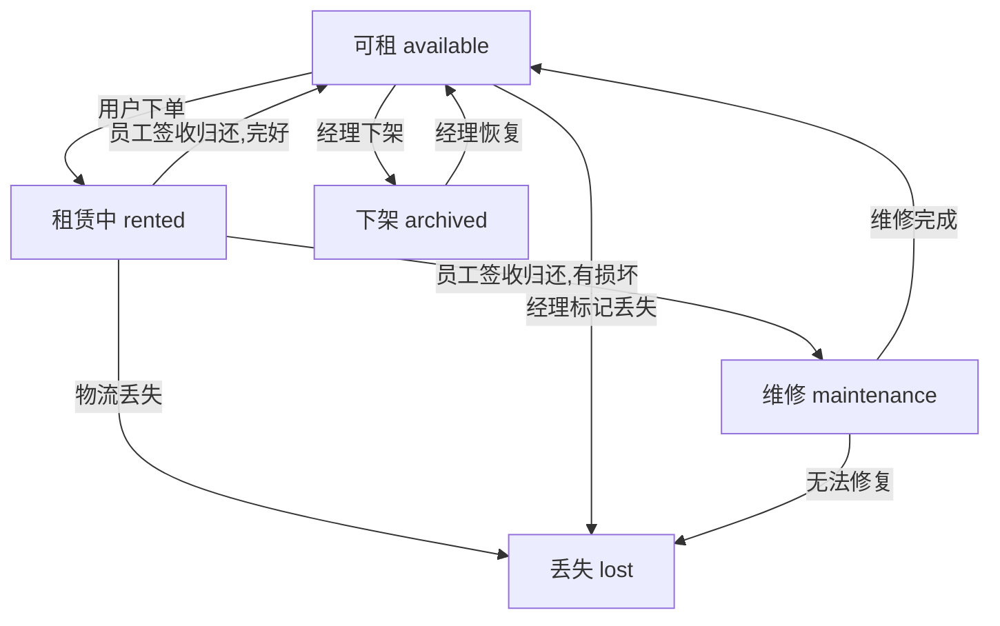
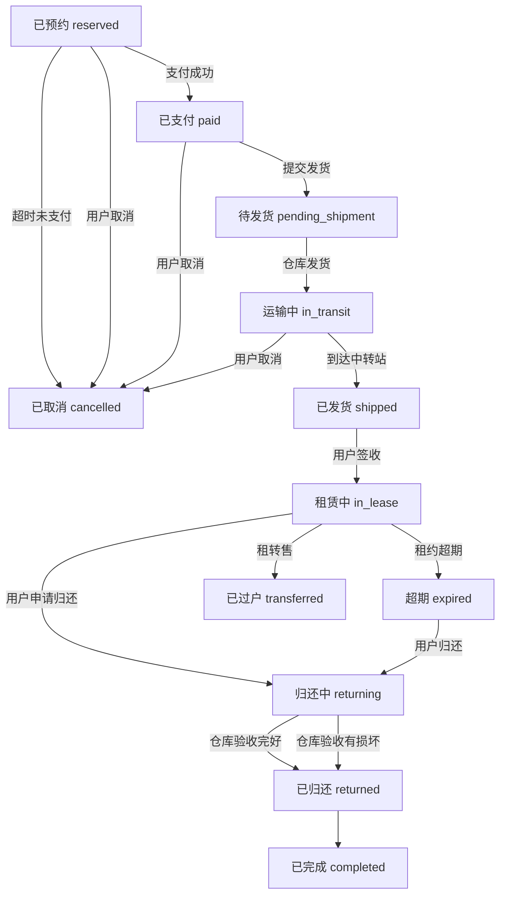

# 用例合集

## 0. 冷启动 (Bootstrapping)

**目标**: 建立系统第一个超级管理员，并锁定初始化入口。

### 0.1 系统初始化流程

1. **访问首页**: 用户访问 `/`
2. **系统检测**: 后端检测 `User` 表是否为空
3. **路由锁定**:
   - 若 `User` 表为空 → 前端自动跳转至 `/setup`
   - 若 `User` 表不为空且访问 `/setup` → 返回 403 或重定向至登录页
4. **创建系统管理员**:
   - 页面显示表单：邮箱、密码
   - 后端动作：
     a. 调用 IAM 创建该用户（角色：Project Admin）
     b. 在 Tuneloop 本地 `users` 表记录 UID
     c. 标记 `is_system_admin = true`
5. **登录循环**: 创建成功后跳转回 `/`，触发 OIDC 流程跳转 IAM 完成首次认证

---

## 0.1 商户管理 (Merchant Management)

**术语对齐**: 商户 (Merchant) → IAM 组织 (Organization)

### 0.1.1 商户列表

**权限**: 仅 JWT 中带有 `project_admin` 声明的用户可见

- 展示字段：商户名称、创建时间、商户唯一代码 (Code/Slug)
- **删除逻辑**: 若该商户下仍有活跃网点或未结清乐器订单，禁止删除

### 0.1.2 商户创建

**表单字段**:
- 商户名称
- 商户代码（用于 URL 或数据隔离标识）
- 联系人信息（姓名、邮箱、电话）
- **指定管理员**: 支持两种场景：
  1. **已有用户** — 搜索 Tab 输入用户名/邮箱/手机，下拉选中，提交 `admin_uid`
  2. **新建用户** — 创建 Tab 填写用户名/姓名/邮箱/手机，提交时 `admin_uid=null`，后端先创建 IAM 用户再创建组织

**后端动作**:
1. 判断 `admin_uid`：
   - 有值 → 场景1，直接使用该用户 ID 创建组织
   - 为 null → 场景2，先调用 IAM `POST /api/v1/users` 创建用户
2. IAM 用户创建：
   - 成功 → 获取 `user_id`，填入 `admin_uid`，继续创建组织
   - 用户名冲突 → 返回 `409` + 已存在用户信息（id/name/email/phone），前端自动切换为场景1
3. 调用 IAM `POST /api/v1/namespaces/:id/organizations` 创建顶级组织
4. IAM 确认后 302 重定向至 `callback_url`，Tuneloop 执行本地同步操作
5. Tuneloop 本地 `merchants` 表记录商户信息及管理员 UID

---

## 0.2 指定用户流程 (User Selection & Provisioning)

**设计思想**: 表单内联、先查后联、无则创建、确认会话。

> **交互模式变更**: 用户搜索与创建功能**直接内嵌在表单中**，不再使用弹窗对话框。
> 搜索框和创建用户按钮作为表单字段的一部分呈现，已选用户以列表形式显示在表单内。

> **商户创建场景特殊说明**: 管理员指定使用双 Tab 结构（搜索/创建），与下文流程一致。区别在于：
> 1. 创建 Tab 提交时 `admin_uid=null`，管理员信息随商户表单一并提交（无需单独「创建并添加」按钮）
> 2. IAM 用户名冲突时后端返回 `409` + 已存在用户详情，前端**自动切换**为搜索 Tab 并预填选中
> 3. 站点/网点成员管理等其他场景不受影响，使用标准流程（见 §0.2.1 - §0.2.4）

### 0.2.1 用户输入与搜索

**界面元素**（内嵌于表单，Tab 切换）:
- **搜索 Tab**：用户搜索输入框（AutoComplete）+ 搜索结果下拉列表
- **创建 Tab**：点击即显示创建表单
- 已选用户列表（显示在 Tab 区域下方）

**交互流程**:
1. 默认为搜索 Tab
2. 在搜索框中输入用户名、邮箱或手机号
3. 系统自动以输入为关键字搜索（debounce 300ms）
4. 下拉框显示搜索结果（最多10项），每项显示：
   - 用户名
   - 匹配的字段（如匹配到邮箱则显示邮箱）
   - 是否已与当前商户关联（associated 标志）
5. 点击结果项添加到已选用户列表
6. 切换到创建 Tab 显示创建表单（隐藏搜索区域）
7. 已选用户始终显示在 Tab 区域下方，可继续搜索添加（多选场景）

**搜索逻辑**:
- 后端分别模糊匹配 name、email、phone 字段
- 返回匹配的用户列表，每项包含：id、name、email、phone、matched_field、associated
- associated=false 表示该用户尚未与当前商户关联

### 0.2.2 已选用户列表

**列表显示**:
- 用户名
- 邮箱
- 手机号
- 删除按钮（每行）
- associated=false 的用户显示醒目标识

**操作**:
- 点击删除按钮从列表中移除用户
- 单选场景（如指定网点管理员）：只显示一条记录，选中后替换已有选择
- 多选场景（如网点增加成员）：显示多条记录，支持批量选择

### 0.2.3 创建新用户

**触发方式**:
- 点击「创建」Tab，直接显示创建表单（无需额外按钮）

**创建表单**（内联展开）:
- 用户名（必填）
- 邮箱（选填，配置后可支持密码重置）
- 手机号（选填）
- 密码设置：支持手动设密或自动生成（12位随机密码）
- 首次登录强制修改密码开关

**四种创建场景**:

| 场景 | admin 操作 | password | 结果 |
|------|-----------|----------|------|
| A | 手动设密 | 提供 | 用户直接激活，无邮件 |
| B | 自动生成（无邮箱） | 空 | 用户激活，前端展示初始密码 |
| C | 自动生成（有邮箱） | 空 | IAM 生成密码 + 发邮件通知 |
| D | 兼容旧流程 | 空 | IAM 发确认邮件 |

**密码规则**（前后端双重校验）:
- 长度 ≥ 8
- 至少 1 个大写字母
- 至少 1 个小写字母
- 至少 1 个数字

**自动生成算法**: 先保证 1 位数字 + 1 位大写 + 1 位小写，再填充 9 位随机字符（大写+小写+数字），最终 shuffle。

**创建成功后流程**:
- 自动生成密码 → 弹出 Modal 展示初始密码（仅展示一次，关闭后无法查看）
- 手动设置密码 → 直接创建成功
- 邮箱为空时，重置密码按钮灰显

### 0.2.4 确认会话 (Confirmation Session)

**架构决策**: 确认流程委托 IAM 管理，Tuneloop 仅接收回调。

**业务规则**:
- 商户创建时，如指定管理员为新用户，IAM 自动发送确认邮件
- 网点添加成员时，**无需确认**（下级组织仅邮件通知）
- 确认提示（仅在商户创建场景）：
  「管理员需在确认邮件中点击确认链接，才会完成商户创建流程」

**IAM 确认流程**:
1. Tuneloop 调用 IAM API 时传入 `callback_url`
2. IAM 创建确认会话（Redis，TTL=24h），发送确认邮件
3. 用户点击邮件中的确认链接 → IAM `GET /confirm?session={id}&action={accept|reject}`
4. IAM 处理确认后 302 重定向至 `callback_url?result=accept|reject|failed`
5. Tuneloop 回调端点接收重定向，执行本地同步操作

**确认类型 (confirm_type)**:
- `create_user`: 用户 status → active
- `create_org`: 用户 status → active + 完成组织绑定；reject → 组织进入孤儿状态（24h 清理）
- `update_user`: 更新用户邮箱
- `bind`: 完成用户与组织绑定

**本地确认会话（状态跟踪）**:
- Tuneloop 本地 `confirmation_sessions` 表仅用于状态跟踪
- 新增 `iam_session_id` 字段关联 IAM 会话
- 新增 `callback_url` 字段记录回调地址
- 回调时同步更新本地会话状态

**失败处理**:
- 超过24小时未确认 → IAM 自动将状态更新为 expired
- 回调 result=failed → 本地记录失败日志

### 0.2.6 个人密码重置

**触发方式**: 用户在个人中心点击「通过邮件重置密码」

**角色**: 所有已登录用户

**前置条件**: 用户已绑定邮箱（`users.email` 不为空）

**操作流程**:
1. 用户点击「通过邮件重置密码」按钮
2. 弹窗确认：「系统将向您的邮箱 xxx 发送密码重置邮件，邮件中的链接 24 小时内有效」
3. 确认后调用 `POST /api/user/reset-password`
4. 后端检查频率限制：每用户每 30 分钟最多 3 次
5. 后端查本地 `users` 表获取邮箱，验证不为空
6. 后端通过服务认证（client_credentials）调用 beaconiam `POST /api/v1/users/reset-password?user_ids=xxx`
7. beaconiam 创建 ConfirmationSession（ConfirmSetupPassword），发送中文密码重置邮件
8. 用户点击邮件中链接，在 beaconiam 页面设置新密码

**密码重置后 JWT 状态**:
- 现有 tuneloop JWT Token 仍然有效（直到过期）
- 这是 JWT 无状态特性决定的，非 bug
- 如需强制所有会话失效，需 beaconiam 侧支持 Token Revocation List（TRL）
- 用户可主动登出后重新登录

**频率限制**:
- 每用户每 30 分钟最多 3 次
- 超出返回 `42900`：「操作过于频繁，请 30 分钟后再试」

**错误处理**:
- 邮箱为空：「您的账户未绑定邮箱，请联系管理员」
- 发送失败：「邮件发送失败，请稍后重试」

**API 代理端点**:
- `POST /api/user/reset-password` — tuneloop 后端代理转发到 beaconiam
- 不涉及密码输入/存储，仅做代理转发

### 0.2.7 自服务修改密码

**触发方式**: 用户在个人中心点击「修改密码」或首次登录强制改密

**角色**: 所有已登录用户

**操作流程**:
1. 用户在新密码表单填写新密码 + 确认密码
2. 前端校验：8位 + 大写 + 小写 + 数字
3. 调用 `POST /api/user/change-password`（`{ new_password }`）
4. 后端双重校验密码规则
5. 后端通过服务认证调用 IAM `PUT /api/v1/users/:id`（更新 password 字段）
6. IAM 成功后，后端清除本地 `users.force_password_change` 标志
7. 返回成功

**频率限制**: 每用户每 5 分钟最多 3 次

**首次登录强制改密**:
- 创建用户时设置 `force_password_change=true`
- `GET /api/users/me` 返回 `force_password_change` 字段
- 前端 `GET /api/users/me` 检查该标志，true 时重定向到 `/user/change-password?first_login=1`
- 后端 `RequirePasswordNotForceChange` 中间件拦截所有 API（除 `/user/change-password`），返回 40302

### 0.2.5 后端实现要点

**IAM Client 代理层**:
- `GetClientToken()` → IAM Token Endpoint (client_credentials grant) — 仅用于 M2M 场景（回调、定时任务等）
- `ExtractUserToken(c *gin.Context)` → 从请求 cookie 或 Authorization header 提取用户 JWT — 用于用户发起的操作
- 用户发起的操作（创建组织/绑定用户等）使用用户 JWT，确保 IAM 权限检查（Owner/Admin 角色）通过
- M2M 操作（回调处理等）使用 client_credentials
- `CreateOrganization(name, parentID, adminInfo, callbackURL)` → POST /namespaces/:id/organizations
- `CreateOrganizationWithToken(token, ...)` → 同上，使用用户 JWT 认证
- `CreateUser(username, name, email, phone, callbackURL)` → POST /api/v1/users
- `CreateUserWithToken(token, ...)` → 同上，使用用户 JWT 认证
- `UpdateUser(userID, name, email, phone, password, callbackURL)` → PUT /api/v1/users/:id
- `BindUserToOrganization(userID, orgID, role)` → PUT /users/:uid/organizations/:oid/bind
- `BindUserToOrganizationWithToken(token, userID, orgID, role, operatorID)` → 同上，使用用户 JWT 认证
- `UnbindUserFromOrganization(userID, orgID)` → PUT (action=unbind)

**新增 API**:
- `GET /api/iam/users/search?q=xxx&limit=10&merchant_id=xxx` —— 模糊搜索用户，返回关联状态
- `POST /api/iam/users` —— 创建用户（传入 callback_url，移除 skipEmail）
- `PUT /api/iam/users/:id` —— 修改用户（邮箱变更触发 IAM 确认）
- `GET /api/iam/confirmation-callback` —— 接收 IAM 确认回调（302 重定向）

**修改 API**:
- `POST /api/merchants` —— 调用 IAM Create Organization（传入 admin 信息 + callback_url）
- `POST /api/sites` —— 新增调用 IAM Create Organization (parent_id=商户org_id) + IAM 三步绑定管理员
- `POST /api/sites/:id/members` —— 调用 IAM Bind API + SetUserCustomerPermissions + AssignRoleTemplate（三步绑定）
- `PUT /api/sites/:id/members/:uid` —— 调用 IAM UpdateUserRoleInOrg/Bind + AssignRoleTemplate 同步角色变更

**数据模型**:
- `sites.org_id` 语义变更：网点自身的 IAM 组织 ID（非商户的组织 ID）
- `confirmation_sessions` 新增 `iam_session_id`、`callback_url` 字段

### 通用 IAM 绑定三步骤

所有人-组织-角色绑定操作统一遵循以下顺序：

1. **BindUser** — PUT /organizations/:oid/users/:uid/bind (action=bind)，建立 user-org 关系，设置 org role（OWNER|ADMIN|STAFF|WORKER）
2. **SetUserCustomerPermissions** — PUT /organizations/:oid/users/:uid/customer-permissions (raw_bits=true)，按角色模板写个人 cus_perm 位图
3. **AssignRoleTemplateToUserWithToken** — POST /users/:uid/roles (role_ids=[template_id])，分配功能角色模板决定 JWT roles/sys_perm

角色名映射：site_admin→ADMIN, site_member→STAFF, worker→WORKER（兼容旧格式 Manager/Staff）

本地 DB 缓存（site_members/users）在所有 IAM 调用成功后同步写入。

---


---

## 0.3 乐器与订单状态机 (Instrument & Order State Machine)

### Instrument 状态机

乐器自身状态与订单流转状态分离。乐器状态仅反映物理状态：



| 状态代码 | 中文名 | 说明 |
|----------|--------|------|
| `available` | 可租 | 乐器在库，可供租赁 |
| `rented` | 租赁中 | 乐器已租出（含发货/运输/归还途中） |
| `maintenance` | 维修 | 乐器损坏，等待或正在维修 |
| `archived` | 下架 | 乐器已下架，不对外租赁 |
| `lost` | 丢失 | 乐器已丢失（物流丢失或实物灭失） |

### Order 状态机

订单状态覆盖从下单到完成的完整流转：



| 状态代码 | 中文名 | 说明 |
|----------|--------|------|
| `reserved` | 已预约 | 订单已创建，等待支付（10分钟超时自动取消） |
| `paid` | 已支付 | 支付已完成，等待发货 |
| `pending_shipment` | 待发货 | 支付完成，准备物流 |
| `in_transit` | 运输中 | 乐器已发出，到达转运站前（用户可取消） |
| `shipped` | 已发货 | 已到达目的地（不可取消） |
| `in_lease` | 租赁中 | 用户已签收，租期内 |
| `returning` | 归还中 | 用户已提交归还，返程物流中 |
| `returned` | 已归还 | 仓库验收完成 |
| `completed` | 已完成 | 租赁流程全部结束 |
| `cancelled` | 已取消 | 订单已取消 |
| `expired` | 超期 | 租约已过期，计逾期费 |
| `transferred` | 已过户 | 租转售完成，乐器所有权转移 |

### 角色可见性

- **用户（顾客）**:
  - 查看乐器列表：除了下架外可见所有乐器，状态只显示"可租"/"不可租"（非 available 即为不可租）
  - 在租赁列表中可看到自己租赁乐器的真实状态
- **员工**:
  - 查看乐器列表：除下架外可见所有乐器及真实状态
- **网点经理**:
  - 查看乐器列表：可见所有乐器（含下架）
  - available/maintenance 状态可切换为 archived，archived 可切换回 available/maintenance
  - 提供开关，可切换查看下级网点乐器（含所属网点列）
- **商户管理员**:
  - 同网点经理，可查看下级网点所有乐器

### 订单可见性

- **用户（顾客）**:
  - 仅可查看自己创建的订单（按 `user_id` 过滤）
- **员工 / 网点管理员**:
  - 可查看所属网点的全部订单（按乐器的 `site_id` 过滤）
  - 不可查看其他网点的订单

---

## 1. 乐器列表
### 1.1 乐器录入

**角色**：租户管理员、网点管理员、网点成员

#### 操作流程

1. **进入乐器录入页面**
   - 从导航栏进入乐器列表 `/instruments`
   - 点击"新建乐器"按钮，跳转至 `/instruments/new`

2. **填写基本信息**
   - **识别码 (sn)**：必填，输入后自动调用后端 API 校验唯一性
   - **乐器分类**：树形下拉框，支持懒加载，点击结点选中，提供链接跳转分类管理
   - **乐器分级**：下拉选择（入门、专业、大师）
   - **归属网点**：
     - 租户管理员：可选任意网点
     - 网点管理员/成员：默认锁定当前所属网点，不可修改

3. **填写附加信息**
   - **描述**：文本输入
   - **动态属性**：根据属性管理中定义的属性，显示对应输入控件
     - 下拉框选择现有值 + 直接输入均可
     - 下拉框默认显示最常用的 3 个属性值
     - 输入时实时搜索过滤，提供包含输入值的前 3 个常用项
     - 提供链接跳转属性管理

4. **上传媒体文件**
   - 图片：最多 6 张，支持拖拽上传
   - 视频：最多 1 段
   - 前端先上传媒体文件到服务器，返回文件 UUID
   - 提交表单时将 UUID 附带上

5. **提交或取消**
   - 点击"提交"：创建乐器成功，返回列表页
   - 点击"取消"：直接返回列表页，不保存

#### 权限说明

| 角色 | 创建乐器 | 默认网点锁定 |
|------|---------|-------------|
| 租户管理员 | ✅ | ❌ 可选 |
| 网点管理员 | ✅ | ✅ 锁定当前网点 |
| 网点成员 | ✅ | ✅ 锁定当前网点 |

### 1.2 乐器批量录入

**场景**：租户管理员或网点管理员需要一次性录入大量乐器（如盘点入库）

**角色**：租户管理员、网点管理员

**前置条件**：已准备好 CSV 模板和对应的乐器图片/视频文件

#### 操作流程

1. **下载模板**
   - 进入乐器列表页面
   - 点击"批量导入"按钮
   - 下载 CSV 模板（包含字段：识别码、分类、级别、描述及动态属性列）
   - 参考模板说明填写数据

2. **上传 CSV 校验**
   - 选择已填好的 CSV 文件上传
   - 系统立即解析并在 Grid 表格中展示数据
   - 自动高亮错误行：
     - 识别码与库中重复（红色背景）
     - 识别码在文件内重复（红色背景）
     - 必填项缺失（红色背景）

3. **在线纠错**
   - 双击错误单元格直接修改
   - 无需重新上传文件
   - 修改后自动重新校验

4. **上传媒体文件包（可选）**
   - 上传 ZIP 文件（包含图片/视频，命名格式：识别码_序号.jpg）
   - 系统自动匹配到对应乐器
   - 未匹配的文件显示在"未匹配区"，可修改文件名后重新匹配

5. **确认创建**
   - 点击"确认导入"
   - 系统事务性创建乐器
   - 完成后显示结果：成功 X 条，失败 Y 条及详情

#### 异常处理

- 文件格式错误：提示正确的 CSV 格式
- 识别码重复：阻止导入，提示冲突
- 部分成功：显示成功/失败明细，支持单独重试失败项

### 1.3 游客浏览乐器（新增）

**角色**：游客（未登录用户）

**场景**：用户打开微信前端链接，无需登录即可浏览乐器列表和详情。

#### 操作流程

1. **访问首页（无参数）**
   - 游客打开链接 `/` 或扫描二维码进入
   - 前端调用 `GET /api/public/instruments`（不含 `tenant` 参数）
   - 后端返回**所有租户**的乐器列表
   - 页面展示乐器图片、名称、租金、网点等信息

2. **带租户参数的访问**
   - 游客打开链接 `/?tenant=<tenant_id>`
   - 前端检测 URL 中的 `tenant` 参数并附加到 API 请求
   - 后端仅返回该商户的乐器列表
   - 适用于不同商户的推广链接场景

3. **浏览乐器详情**
   - 点击乐器卡片进入详情页 `/instrument/:id`
   - 调用 `GET /api/public/instruments/:id`
   - 显示完整信息（租金政策、级别选择、网点位置、服务权益对比）

4. **下单入口**
   - 底部"立即租赁"按钮：未登录则跳转登录，已登录则进入结算流程

### 1.4 购物车管理（新增）

**角色**：游客 / 已登录用户

**场景**：用户希望一次租赁多部乐器，先收集到购物车再统一下单。

#### 操作流程

1. **悬浮购物车图标**
   - 屏幕右下角悬浮显示购物车图标
   - 图标右上角显示数字角标（购物车中乐器件数）
   - 点击跳转到 `/cart` 购物车页面

2. **加入购物车**
   - 在乐器详情页，若乐器状态为 `in_stock`（可租），底部显示"加入购物车"按钮
   - 若该乐器已在购物车中，按钮显示"已加入"并 disabled
   - 点击"加入购物车"
   - 数据存储到 localStorage：`{items: [{instrument_id, name, site_id, site_name, tenant_id, pricing, ...}]}`
   - 弹出"加入成功"Toast，提供两个选项：
     - **继续浏览**：关闭弹窗，留在详情页
     - **去结算**：导航至 `/cart` 购物车页面
   - 悬浮购物车图标数字 +1

3. **查看购物车**
   - 用户访问 `/cart` 页面
   - 从 localStorage 读取购物车数据
   - **三级分组展示**：商户 → 网点 → 乐器
   - 每个乐器项显示：图片、名称、租期、截止日、金额
   - 每项右侧有删除按钮，点击从购物车移除
   - 加载时检查乐器状态，已下架/被租者置灰显示"已失效"，提供"一键清理"

4. **收货地址**
   - 默认显示用户地址（从 profile 或 localStorage）
   - "修改"按钮 → Modal 输入新地址 → 确认替换
   - 增加"备注"字段（楼层、是否有电梯等）

5. **费用明细**
   - 每件：租金 × 租期 + 押金
   - 每网点：+ 物流费
   - 每商户：小计
   - 底部显示需支付总额：TotalPayable = Σ(rent×period + deposit) + Σ(shipping_fee per site)

6. **空购物车**
   - 购物车为空时显示空状态提示
   - 提供"去逛逛"按钮，点击返回首页

### 1.5 批量下单（新增）

**角色**：已登录用户

**场景**：从购物车提交多件乐器的租赁订单。

#### 操作流程

1. **下单校验**
   - 用户点击购物车底部"支付"按钮
   - 系统检查登录状态：
     - 未登录 → 跳转登录页，登录后返回购物车
     - 已登录 → 继续下单
   - 检查乐器库存（软锁机制）

2. **一阶段支付（当前）**
   - 点击支付 → 生成订单记录 → 清空购物车对应项 → 跳转完成页
   - 跳过真实支付流程
   - **库存软锁**：创建订单时标记 instrument 为 reserved

3. **完成页（电子收据）**
   - 全屏设计（适配截图）
   - 显示：订单号、乐器识别码明细、支付时间、租赁起止日、总额
   - "完成"按钮 → 回到乐器列表

4. **二阶段（预埋）**
   - 预留真实支付接口调用位置
   - 支付完成后跳转到完成页

### 1.6 登录后购物车合并（新增）

**角色**：游客 → 已登录用户

**场景**：未登录时选的乐器，登录后需要合并到数据库。

1. **登录成功后检查**
   - 登录成功后检查 localStorage cart
   - 若不为空，提示"是否合并未登录时选中的商品？"
   - 确认后合并到数据库（预留 API 接口）

## 2. 租赁闭环

### 2.1 库存管理&租金设定
网点经理登录
从右侧导航栏的库存监控进入管理界面，可看到库存中的乐器列表（识别码、分类、级别、品牌、型号、网点、租金基准）
可设置按品牌、型号、类别、级别筛选乐器
最右列为租金基准，以货币输入框显示每件乐器的日租金、押金、物流费、逾期日费，可修改
当经理做了修改，页面上的『保存』按钮就激活，点击就批量完成租金设定

### 2.2 乐器租赁 

用户打开小程序界面可以看到乐器列表，有日租金说明、可以通过类别、网点、级别、可租状态筛选
点选乐器，进入乐器详情，
- 可以看到乐器最新一批图片
- 可以看到品牌、型号、简介
- 可以看到日、周、月租金、押金说明
  - 费用计算公式：费用 = 单期费用 × 期数 + 押金 + 物流费
  - 日租金 = instrument.pricing[0].daily_rent
  - 周租金 = instrument.pricing[0].weekly_rent（未定义时使用 daily_rent × 6 作为回退）
  - 月租金 = instrument.pricing[0].monthly_rent（未定义时使用 daily_rent × 25 作为回退）
- 押金：后台设定（乐器归还、质检通过后原路退还，损坏则定损抵扣）
- 物流费：后台设定
- 逾期日费：后台设定（默认等于日租金），逾期后每日自动扣款
- 可以点击下单，选择租期类型（按日/周/月）、数量，确认收货地址，跳转到支付界面
- 完成支付，乐器进入预订状态
- 系统
  - 生成发货通知
  - 系统自动生成一张电子合同或收据（PDF 格式），存入用户的“我的资料”中，作为租赁凭证
租赁期间，用户进入『我的』，
- 可以看到租赁会话列表（乐器类别、到期时间）
- 点击可以查看订单详情
租赁期满，用户进入『我的』，
- 点击期满的租赁会话，在租赁详情中点归还
- 输入物流信息，乐器进入归还状态

### 2.3 库管
员工在PC端登录
检查预订状态的订单列表，安排物流
- **发货前拍照留档**：员工在发货前，按乐器分类对应的拍照要求对乐器进行拍照
  - 拍照要求由商户级配置（当前使用默认占位数据）
  - 每次拍照生成一个批次，同一天同一乐器的员工拍照归为同一批次
  - 批次照片打包为 ZIP 文件（含 manifest.yaml 元数据）
  - 系统保留最近一次员工拍照的照片，用于归还验收时对比
- 交付物流后，将物流信息填写在订单上，乐器进入发货状态
每天定时检查发货的订单列表
- 发货状态的乐器物流到达后进入租赁状态，以物流到达时间点为起租点
归还的乐器到货后
- 扫码乐器上的二维码，可以看到乐器相关信息和租赁信息
- 按规定对乐器拍照，照片会上传到服务器
- 若乐器没有损坏，则点击『归还』恢复为在库状态
  - 系统自动生成退还押金事务
- 若乐器损坏，
  - 点击定损，输入评论，金额，点击提交
  - 乐器进入维修状态、创建维修会话待分配状态

## 2.4 申诉
用户小程序上，在有损坏的情况下，
- 收到定损通知（包括照片、评论、金额）
- 点击『同意』，
  - 如果押金足以覆盖赔付，则系统自动扣除定损金额后生成退还押金事务
  - 如果押金不足以覆盖，则进入支付页面
  - 如果支付失败可重试，如果超时未完成则按申诉处理，系统记录申诉
- 点击『申诉』，输入理由，提交。系统记录申诉，乐器进入待处理状态
网点经理可通过查看申诉列表：
- 相关乐器基本信息、租金、当前图片
- 用户、员工信息，员工的定损说明和用户的申诉理由
- 租赁过程
网点经理可以
- 点击『无损坏』，取消赔款，直接生成退还事务，乐器进入在库状态
- 调整定损金额
- 输入说明
- 点击『确定』，乐器进入维修状态。若押金扣除赔款后>0则系统会自动生成退还押金事务。

# 3. 维修

# 3.1 维修师傅管理

网点经理进入网点管理
可以创建维修师傅账户（输入姓名、电话等）
可以删除维修师傅账户
可以查看维修师傅列表，包括姓名、电话，最近一个月完成的单数
点击进入可以查看每个师傅最近完成的维修订单具体情况

# 3.2 维修会话

维修师傅用自己的账户登录PC 端或微信端
可以查看自己所属网点的维修订单列表（日期、类别、简述、状态）和自己的在手订单列表
点击可以查看订单的详情，包括乐器的照片
如果是待分配状态，订单上会有『接单』按钮，点击后就转为已分配状态，订单加入当前用户的订单列表
师傅在微信端端点击『开始工作』，扫描乐器二维码，乐器进入维修状态
维修过程中师傅可以输入评论、上传照片
维修完成后，师傅点击『完成』按钮，乐器进入验收状态
网点员工用自己的账户登录微信端
可以查看自己所属网点的维修订单列表
对于验收状态的乐器，员工
- 用微信端扫描乐器二维码
- 按规定完成拍照上传图片
- 点击『验收通过』，维修订单结束，乐器回到在库状态
- 点击『验收不通过』，需要添加评论，乐器回到待处理状态

# 4. 组织管理

## 4.1 网点管理

### 4.1.1 网点列表

网点经理登录PC端
从左侧导航栏的组织管理->网点管理进入
左侧显示网点树状列表（懒加载）
可点击展开查看子网点
右上角有『创建顶级网点』按钮

### 4.1.2 新建网点

点击『创建顶级网点』
URL切换到/sites/new
右侧显示新建网点表单
填写网点名称、类型（加盟/直营/合作店）、地址、联系电话
**指定网点管理员**: 表单内嵌用户搜索框 + 「创建新用户」虚线按钮（见 §0.2），单选模式
- 选中后显示管理员姓名和邮箱，可点击「更换」重新选择
- 初始角色默认为 `site_admin`
提交前检查网点名是否重复
**后端动作**:
1. 调用 IAM `POST /api/v1/namespaces/:id/organizations` 创建下级组织（parent_id = 所属商户的 org_id）
2. 存储返回的 org_id 到 site 记录（网点自身的 IAM 组织 ID）
3. 执行 IAM 三步绑定（管理员角色 = site_admin）：
   a. PUT /organizations/:oid/users/:uid/bind (action=bind, role=ADMIN)
   b. PUT /organizations/:oid/users/:uid/customer-permissions (raw_bits=true, cus_perm=site_admin 模板值)
   c. POST /users/:uid/roles (role_ids=[site_admin_template_id]) — 分配角色模板
4. 本地 `site_members` 表同步创建成员记录
提交成功后左侧网点树自动更新并选中新建网点

### 4.1.3 查看网点详情

点击网点树节点
URL切换到/sites/:id
右侧显示网点详情（名称、类型、地址、电话、负责人）
负责人作为链接可点击跳转至/staff/:id

### 4.1.4 编辑网点

在详情页点击『编辑』按钮
URL切换到/sites/:id/edit
右侧显示编辑网点表单（可复用新建表单）
提交后返回详情页，左侧网点树同步更新

### 4.1.5 网点人员管理

**权限**: 商户管理员或具有租户全局权限的用户

#### 4.1.5.1 人员列表展示

| **用户名** | **角色类别 (Role)** | **操作**        |
| ---------- | ------------------- | --------------- |
| 张三       | 管理员 (Manager)    | 切换角色 / 移除 |
| 李四       | 成员 (Staff)        | 切换角色 / 移除 |

#### 4.1.5.2 角色切换逻辑

- **规则保护**: 若该用户是当前网点**最后一名管理员**，禁止将其切换为成员或删除
- IAM 侧同步（升级/降级均需）：
  a. PUT /organizations/:oid/users/:uid/role — 更新 org role（ADMIN↔STAFF）
  b. POST /users/:uid/roles — 重新分配角色模板（site_admin↔site_member）
- 本地 `site_members` 表同步更新角色字段

#### 4.1.5.3 增加成员

- 成员列表上方内嵌用户搜索框 + 「创建新用户」虚线按钮（见 §0.2），多选模式
- 选中用户后显示在已选列表中，可继续搜索添加
- 点击「确认添加」后，执行 IAM 三步绑定：
  1. PUT /organizations/:oid/users/:uid/bind — 绑定用户到网点，设置 org role（ADMIN|STAFF|WORKER）
  2. PUT /organizations/:oid/users/:uid/customer-permissions (raw_bits=true) — 按角色模板写个人 cus_perm 位图
  3. POST /users/:uid/roles — 分配功能角色模板（决定 JWT roles / sys_perm / cus_perm）
- 角色名映射规则：site_admin→ADMIN, site_member→STAFF, worker→WORKER（兼容旧格式 Manager/Staff）
- 下级组织绑定仅需邮件通知，**无需用户确认**，即时生效
- 本地 `site_members` 表同步创建记录
- 初始角色默认为 `site_member`

#### 4.1.5.4 移除成员

- 点击『移除』按钮
- **保护规则**: 最后一名管理员不可移除
- 在 `site_members` 表删除对应记录

### 4.1.6 删除网点

**前置检查**（重要安全校验）：

1. **资产校验**: 调用库存模块接口，检查该网点下 `instruments` 表：
   - 若有 `stock_status = 'available'`（在库）的乐器 → 警告并拒绝删除，提示"请先转移资产"
   - 若有 `stock_status = 'rented'`（在租）的乐器 → 警告并拒绝删除，提示"请先处理在租订单"
   
2. **人员检查**: 若 `site_members` 表中仍有成员 → 提示"请先移除所有成员"

**删除流程**:
- 在详情页点击『删除』按钮
- 系统执行上述校验
- 全部通过时弹出确认对话框
- 确认后调用API删除网点（软删除，状态设为 'closed'）
- 左侧网点树同步移除该节点

---

## 4.2 人员管理

## 4.2 人员管理

### 4.2.1 人员列表

从左侧导航栏的组织管理->人员管理进入
URL为/staff
主体显示人员列表（姓名、邮箱、电话、归属网点、职位、角色、状态）
支持按姓名和网点搜索
支持分页
姓名可点击查看用户详情

### 4.2.2 创建用户

点击『创建用户』按钮
弹出用户创建对话框
填写用户名、姓名、邮箱、电话、归属网点、职位、角色
归属网点下拉框采用树状展示
点击提交
- 系统���查邮箱/电话唯一性
- 如有冲突，弹出选择对话框列出已有用户
- 可选择"继续创建"或"选择已有用户"
创建成功，对话框关闭，列表刷新

### 4.2.3 编辑用户

点击人员列表中的『编辑』按钮
弹出用户编辑对话框
可修改姓名、归属网点、职位、角色
可修改邮箱和电话：
- 邮箱变更：调用 IAM `PUT /api/v1/users/:id`，传入 `callback_url`，IAM 自动发送确认邮件
- 确认后回调 Tuneloop 更新本地邮箱记录
- 手机号变更：留 Stub（IAM 侧暂不实现）
提交后列表刷新


---

## 附录：权限相关流程总结

### 1. 权限体系架构

TuneLoop 使用 **双层位图** 实现权限控制：

| 层级 | 来源 | 字段 | 用途 |
|------|------|------|------|
| **sys_perm** | IAM 内置位码 (0-24) | JWT 字段 | 控制结构操作：网点管理、人员管理、角色配置等 |
| **cus_perm** | TuneLoop 业务注册 | JWT 字段 | 控制业务操作：乐器 CRUD、库存、订单、维修等 |

**关键概念澄清**：
- sys_perm 和 cus_perm 只是**权限来源不同**，不是级别高低
- site_admin 可以有 sys_perm（看到菜单）+ cus_perm（业务操作）
- **授权范围**由后端 API 的 site_id/org_id 过滤控制（不是前端菜单）

### 2. 角色模板定义位置

**Beaconiam 端** (`internal/models/functional_role_template.go`)：
- 存储角色模板基础信息
- 包含 `cus_perm`（客户权限位图）
- **当前缺失 `sys_perm` 字段**（见 beaconiam Issue #157）

**TuneLoop 端** (`backend/services/role_templates.go`)：
- 定义完整的角色权限映射
- 包含 `SysPermBits`（系统权限位码数组）
- 包含 `CusPermCodes`（客户权限代码数组）

### 3. 权限计算流程（登录时）

```
用户登录
  ↓
Beaconiam /oauth/token
  ↓ 计算最终权限：
  - SysPerm = organization.sys_perm OR user_org_relations.sys_perm OR functional_role_templates.sys_perm
  - CusPerm = organization.cus_perm OR user_org_relations.cus_perm OR functional_role_templates.cus_perm
  ↓
生成 JWT Token（包含 sys_perm, cus_perm）
  ↓
返回给前端
```

### 4. 前端菜单过滤流程

```
用户登录成功
  ↓
App.jsx 解析 JWT：
  - sys_perm = payload.sys_perm || payload.sysPerm
  - cus_perm = payload.cus_perm || payload.cusPerm
  - 从 localStorage 读取 permission_mapping
  ↓
filterMenuByRole() - 角色过滤
  ↓
checkRule() - 权限位过滤
  - 检查 menuRules 中的 sysPermBits / cusPermCodes
  - requireAllGroups: true 要求两个条件同时满足
  ↓
渲染可见菜单
```

### 5. 修改角色权限后的刷新问题

当修改 `backend/services/role_templates.go` 后：
- **已登录用户的权限不会自动刷新**（JWT token 已签发）
- 需要用户**清除 localStorage 并重新登录**
- 如果用户不主动刷新，需要实现 perm_version 机制（见 tunerloop Issues #446, #447 及 beaconiam Issue #156）

### 6. 相关 Issue

| Issue | 仓库 | 标题 | 状态 |
|-------|------|------|------|
| #156 | beaconiam | JWT 权限变更后需手动清除 localStorage，缺乏自动刷新机制 | todo |
| #157 | beaconiam | FunctionalRoleTemplate 缺少 sys_perm 字段 | todo |
| #446 | tuneloop | 后端权限变更时递增 JWT perm_version | todo |
| #447 | tuneloop | 前端 JWT perm_version 检测 | todo |

### 7. sys_perm 位码对照表

| 位码 | 名称 | 控制的菜单 |
|------|------|-----------|
| 0 | namespace_view | 客户端管理 |
| 5 | tenant_view | 商户管理 |
| 10 | organization_view | 网点管理 |
| 11 | organization_list | 网点管理 |
| 15 | user_view | 人员管理 |
| 16 | user_list | 人员管理 |
| 17 | user_create | 人员批量导入 |
| 20 | role_view | 角色管理 |

---
*最后更新: 2026-05-08*
*Model: kimi-k2.6*

